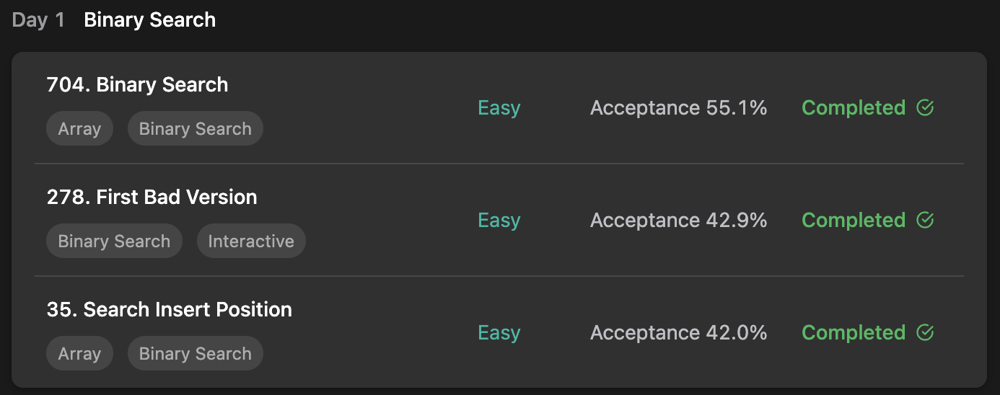

## LeetCode Algorithm StudyPlan



### Day 1

- [704. Binary Search](https://leetcode.com/problems/binary-search/?envType=study-plan&id=algorithm-i)
- [278. First Bad Version](https://leetcode.com/problems/first-bad-version/?envType=study-plan&id=algorithm-i)
- [35. Search Insert Position](https://leetcode.com/problems/search-insert-position/?envType=study-plan&id=algorithm-i)

---

#### 704. Binary Search

- **lang**  `kotlin` 
- **tags**  `Binary Search`

```kotlin
class Solution {
  	// main function
    fun search(nums: IntArray, target: Int): Int {
        return binarySearch(nums, target, 0, nums.size)
    }
    // with recursive function
    fun binarySearch(nums: IntArray, target: Int, l: Int, r: Int): Int {
      	// if l pointer pass over r pointer, it means search failure
        if (l >= r) return -1
      	// get search pointer
        val mid = (l+r) / 2
        return when {
          	// move search scope to (middle ~ end) 
            nums[mid] < target -> binarySearch(nums, target, mid + 1, r)
          	// move search scope to (start ~ middle)
            nums[mid] > target -> binarySearch(nums, target, l, mid)
          	// search success
            else -> mid
        }
    }
}
```

---

#### 278. First Bad Version

- **lang** `kotlin`
- **tags** `Binary Search`

> At first, Error occured. ( Runtime Error - **Line 16: Exception in thread "main" java.lang.StackOverflowError** ) 
>
> ```kotlin
> // last Input
> 2126753390
> 1702766719
> ```
>
> **Analyze**
>
> **`kotlin Int`** is 4byte and can serve `-21B ~ 21B` . At upper case, summation is over `Int value range` stack overflow will occur. Just fix the calculation for middle cursor like below.
>
> ```kotlin
> // origin
> val x = (l+r)/2
> // fixed
> val x = l + (r-l)/2
> ```

```kotlin
class Solution: VersionControl() {
    override fun firstBadVersion(n: Int) : Int {
        return findInternal(1, n)
	}
    // Internal recursive search function
    fun findInternal(l: Int, r: Int): Int {
        // if cursor overlapped, minimum value is firstBad
        if (l >= r) return l
        // avoid :: if Int value is big enough, stack overflow error will occur
        val x = l + (r-l)/2
        return when (isBadVersion(x)) {
            // if target is badVersion, move scope to start dir
            true -> findInternal(l, x)
            // if target isn't badVersion, move scope to end dir
            false -> findInternal(x+1, r)
        }
    }
}
```

---

#### 35. Search Insert Position

- **lang** `kotlin`
- **tags** `Binary Search`

```kotlin
class Solution {
    fun searchInsert(nums: IntArray, target: Int): Int {
        return searchInternal(nums, target, 0, nums.size)
    }
    
    fun searchInternal(nums: IntArray, target: Int, l: Int, r: Int): Int {
        // can't move left cursor anymore, find proper insert position
        if (l >= r) return l
        val x = (l+r)/2
        return when {
            // move cursor to start
            nums[x] > target -> searchInternal(nums, target, l, x)
            // move cursor to end
            nums[x] < target -> searchInternal(nums, target, x+1, r)
            // find
            else -> return x
        }
    }
}
```