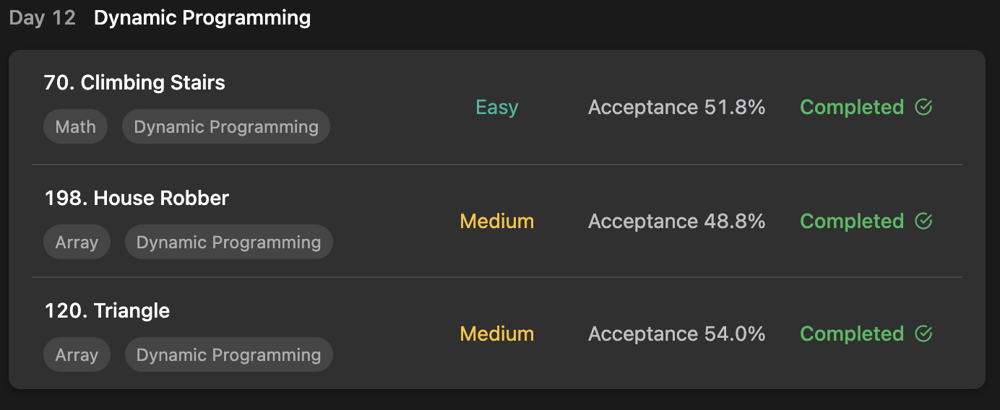

## LeetCode Algorithm StudyPlan



### Day 12

- [70. Climbing Stairs](https://leetcode.com/problems/climbing-stairs/?envType=study-plan&id=algorithm-i)
- [198. House Robber](https://leetcode.com/problems/house-robber/?envType=study-plan&id=algorithm-i)
- [120. Triangle](https://leetcode.com/problems/triangle/?envType=study-plan&id=algorithm-i)

---

#### 70. Climbing Stairs

- **lang**  `kotlin` 
- **tags**  `Math` `DP` `Memoization`  

```kotlin
class Solution {
    fun climbStairs(n: Int): Int {
        val dp = IntArray(n+1)
        if (n < 3) return n
        dp[0] = 0
        dp[1] = 1
        dp[2] = 2
        /*
            stair climbing way counting logic
            1. can jump 1 or 2 stairs
            2. so count of [i] ?
                1) [i-1] ways + jump 1
                2) [i-2] ways + jump 2
        */
        for (i in 3..n) dp[i] = dp[i-1] + dp[i-2]
        return dp[n]
    }
}
```

---

#### 198. House Robber

- **lang**  `kotlin` 
- **tags**  `Array` `DP` 

```kotlin
import kotlin.math.*
class Solution {
    fun rob(nums: IntArray): Int {
        // avoid index out of range
        val size = nums.size
        if (size == 1) return nums[0]
        if (size == 2) return max(nums[0], nums[1])
        /*
            robbing best logic
            if current house = i, rob this or not ?
            1) rob this house = max : this + acc[this-2]
            2) don't rob this house = max : acc[this-1]
        */
        val dp = IntArray(nums.size)
        dp[0] = nums[0]
        dp[1] = max(nums[0], nums[1])
        var i = 1
        while (++i < size) {
            dp[i] = max(nums[i] + dp[i-2], dp[i-1])
        }
        return dp[size-1]
    }
}
```

---

#### 120. Triangle

- **lang**  `kotlin` 
- **tags**  `Array` `DP` 

```kotlin
import kotlin.math.min
class Solution {
    fun minimumTotal(triangle: List<List<Int>>): Int {
        val depth = triangle.size
        if (depth == 1) return triangle[0][0]
        var cursor = 1
        var result = Int.MAX_VALUE
        var beforeLevel = IntArray(1).apply { set(0, triangle[0][0]) }
        while (cursor < depth) {
            var level = IntArray(cursor+1)
            triangle[cursor].forEachIndexed { idx, value -> 
                // each loc's minimum step
                // first or last : before's first / last + loc
                // else : before's idx-1 or idx + loc
                level[idx] = value + when {
                    idx == 0 -> beforeLevel[0]
                    idx == cursor -> beforeLevel[idx-1]
                    else -> min(beforeLevel[idx-1], beforeLevel[idx])
                }
                /*
                    avoid traverse calculation when last level arrived.
                    
                    if do not realtime-calculation, 
                    have to min calculation on last level ( TC + O(n) )
                */
                if (cursor == depth-1) result = min(result, level[idx])
            }
            beforeLevel = level
            cursor ++
        }
        return result
    }
}
```

---

