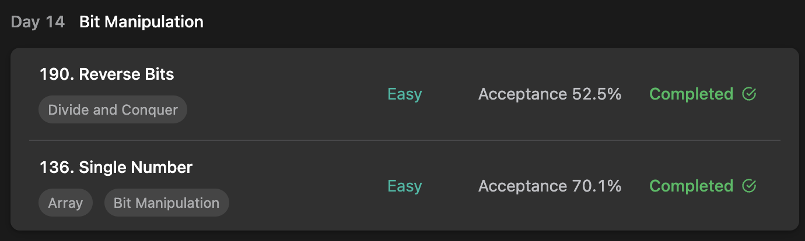
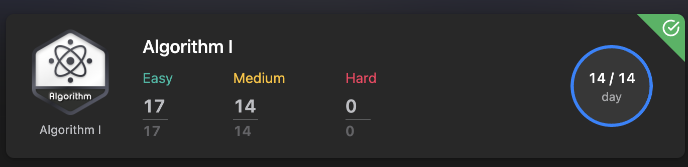

## LeetCode Algorithm StudyPlan





### Day 14

- [190. Reverse Bits](https://leetcode.com/problems/reverse-bits/?envType=study-plan&id=algorithm-i)
- [136. Single Number](https://leetcode.com/problems/single-number/?envType=study-plan&id=algorithm-i)

---

#### 190. Reverse Bits

- **lang**  `kotlin` 
- **tags**  `Divide and Conquer` `BitManipulation` 

```kotlin
class Solution {
    // you need treat n as an unsigned value
    fun reverseBits(n:Int):Int {
        // return Integer.reverse(n)
        return n.reverseBit()
    }
    
    fun Int.reverseBit(): Int {
        var num = this
        var pos = 0
        /*
            answer -> shift to left and fill bits
            num -> shift to right and calculate answer
            answer = answer | ( reverse of num's first bit )
                   = answer | ( num & 1 )
        */
        for (i in 1..32) {
            pos = pos.shl(1)
            pos = pos.or(num.and(1))
            num = num.shr(1)
        }
        return pos
    }
}
```

---

#### 136. Single Number

- **lang**  `kotlin` 
- **tags**  `Array` `BitManipulation` 

```kotlin
class Solution {
    fun singleNumber(nums: IntArray): Int {
        return nums.seekSingle()
    }
    fun IntArray.seekSingle(): Int {
        /**
            4, 3, 4, 5, 3
            100, 011, 100, 101, 011
            
            000 ^ 100 = 100
            100 ^ 011 = 111
            111 ^ 100 = 011
            011 ^ 101 = 110
            110 ^ 011 = 101 (5)
        */
        var bit = 0
        this.forEach { value -> bit = bit.xor(value) }
        return bit
    }
}
```

---

