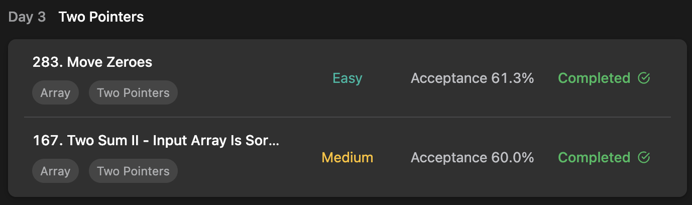

## LeetCode Algorithm StudyPlan



### Day 3

- [283. Move Zeroes](https://leetcode.com/problems/move-zeroes/?envType=study-plan&id=algorithm-i)
- [167. Two Sum II - Input Array Is Sorted](https://leetcode.com/problems/two-sum-ii-input-array-is-sorted/?envType=study-plan&id=algorithm-i)

---

#### 283. Move Zeroes

- **lang**  `kotlin` 
- **tags**  `Array`  `Two Pointers`

```kotlin
class Solution {
    fun moveZeroes(nums: IntArray): Unit {
        // pointer indicates zero
        var zero = 0
        // seek which is non-zero
        for(nonZero in 0..nums.size-1) {
            // if it's non-zero, swap and move last zero pointer
            if (nums[nonZero] != 0) {
                // avoid worst case : many nonZero numbers in leading
                // -- avoid useless swap
                if (zero != nonZero) {
                    val data = nums[nonZero]
                    nums[nonZero] = nums[zero]
                    // if swap occur, it means
                    nums[zero] = data
                }
                zero++
            }
        }
    }
}
```

---

#### 167. Two Sum II - Input Array Is Sorted

- **lang**  `kotlin` 
- **tags**  `Array`  `Two Pointers` `Binary Search` 

```kotlin
class Solution {
    fun twoSum(nums: IntArray, target: Int): IntArray {
        /*
            calculation
            1. if summation > target, must decrease summation. so move right pointer
            2. if summation < target, must increase summation. so move left pointer
        */
        var left = 0
        var right = nums.size - 1
        var sum = nums[left] + nums[right]
        while(sum != target) {
            if (sum > target) right--
            else left++
            sum = nums[left] + nums[right]
        }
        return intArrayOf(left+1, right+1)
    }
}
```

---

