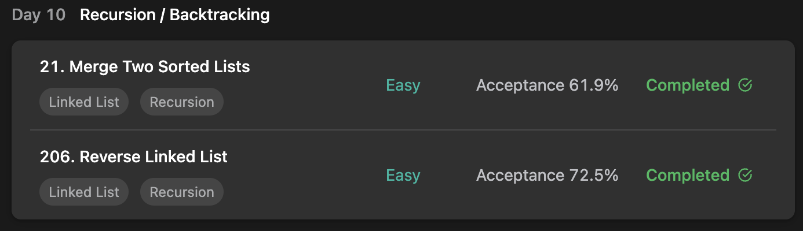

## LeetCode Algorithm StudyPlan



### Day 10

- [21. Merge Two Sorted Lists](https://leetcode.com/problems/merge-two-sorted-lists/?envType=study-plan&id=algorithm-i)
- [206. Reverse Linked List](https://leetcode.com/problems/reverse-linked-list/?envType=study-plan&id=algorithm-i)

---

#### 21. Merge Two Sorted Lists

- **lang**  `kotlin` 
- **tags**  `LinkedList` `Recursion`

```kotlin
/**
 * Example:
 * var li = ListNode(5)
 * var v = li.`val`
 * Definition for singly-linked list.
 * class ListNode(var `val`: Int) {
 *     var next: ListNode? = null
 * }
 */
class Solution {
    fun mergeTwoLists(list1: ListNode?, list2: ListNode?): ListNode? {
        // dummy node for merge starter
        val start = ListNode(0)
        // writer pointer and reader (list1, list2) pointers
        var writer = start
        var reader1 = list1
        var reader2 = list2
        // compare each reader's current node and attach to writer node
        while (reader1 != null && reader2 != null) {
            if (reader1.`val` < reader2.`val`) {
                writer.next = ListNode(reader1.`val`)
                reader1 = reader1.next
            } else {
                writer.next = ListNode(reader2.`val`)
                reader2 = reader2.next
            }
            writer = writer.next
        }
        // if one's cursor ended, attach rest of another to writer node.
        if (reader1 == null) writer.next = reader2
        else if (reader2 == null) writer.next = reader1
        // return writer node's root except for dummy node.
        return start.next
    }
}
```

---

#### 206. Reverse Linked List

- **lang**  `kotlin` 
- **tags**  `LinkedList` `Recursion`

```kotlin
/**
 * Example:
 * var li = ListNode(5)
 * var v = li.`val`
 * Definition for singly-linked list.
 * class ListNode(var `val`: Int) {
 *     var next: ListNode? = null
 * }
 */
class Solution {
    fun reverseList(head: ListNode?): ListNode? {
        // reader pointer
        var cursor: ListNode? = head
        // writer pointer
        var result: ListNode? = null
        // iterate all nodes
        while (cursor != null) {
            // attach this node to result's last
            val temp = ListNode(cursor.`val`)
            temp.next = result
            result = temp
            cursor = cursor.next
        }
        return result
    }
}
```

---

