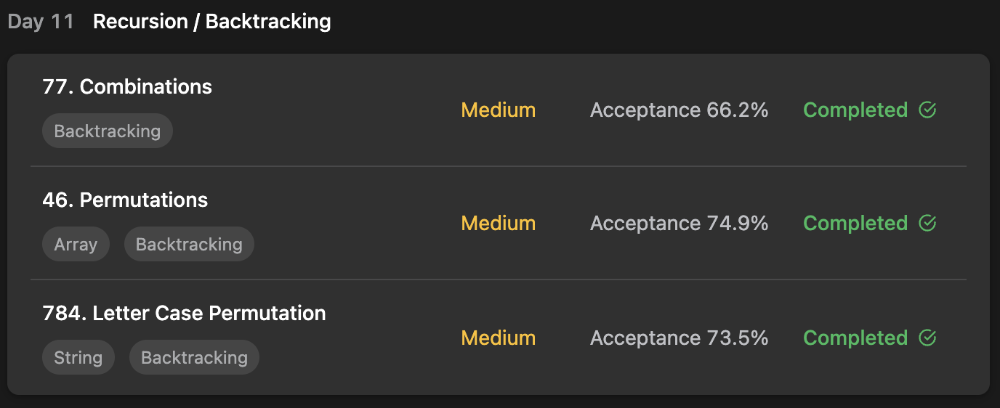

## LeetCode Algorithm StudyPlan



### Day 11

- [77. Combinations](https://leetcode.com/problems/combinations/?envType=study-plan&id=algorithm-i)
- [46. Permutations](https://leetcode.com/problems/permutations/?envType=study-plan&id=algorithm-i)
- [784. Letter Case Permutation](https://leetcode.com/problems/letter-case-permutation/?envType=study-plan&id=algorithm-i)

---

#### 77. Combinations

- **lang**  `kotlin` 
- **tags**  `BackTracking` 

```kotlin
class Solution {
    private val result = mutableListOf<List<Int>>()
    
    fun combine(n: Int, k: Int): List<List<Int>> {
        track(listOf<Int>(), 1, n, k)
        return result
    }
    // track sorted - order and adding branches
    fun track(list: List<Int>, i: Int, n: Int, k: Int) {
        // if k-elements all filled, add result
        if (list.size == k) {
            result.add(list)
            return
        }
        // add rest elements
        for (j in i..n) {
            // for temporary immutable list
            var current = list
            track(current + j, j+1, n, k)
        }
    }
}
```

---

