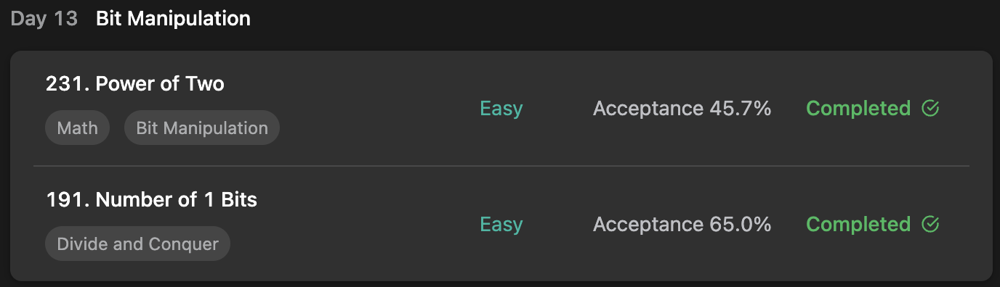

## LeetCode Algorithm StudyPlan



### Day 13

- [231. Power of Two](https://leetcode.com/problems/power-of-two/?envType=study-plan&id=algorithm-i)
- [191. Number of 1 Bits](https://leetcode.com/problems/number-of-1-bits/?envType=study-plan&id=algorithm-i)

---

#### 231. Power of Two

- **lang**  `kotlin` 
- **tags**  `Math` `for loop` `BitManipulation` `Recursion` 

```kotlin
class Solution {
    fun isPowerOfTwo(n: Int): Boolean {
        // return loop(n)
        // return recursion(n)
        return bitwise(n)
    }
    // loop solution
    fun loop(n: Int): Boolean {
        if (n == 0) return false
        var k = n
        while (k % 2 == 0) k = k/2
        return if (k == 1) true else false
    }
    // recursion solution
    fun recursion(n: Int): Boolean {
        if (n == 0) return false
        if (n == 1) return true
        return if (n % 2 == 0) recursion(n/2) else return false
    }
    /*
        bitwise
        16: 10000
        15: 01111
        & : 00000
        so if n == 2^k, n and n - 1 == 0
    */
    fun bitwise(n: Int): Boolean {
        if (n == 0) return false
        return n > 0 && n.and(n-1) == 0
    }
}
```

---

#### 191. Number of 1 Bits

- **lang**  `kotlin` 
- **tags**  `Divide and Conquer` `BitManipulation`

```kotlin
class Solution {
    // you need treat n as an unsigned value
    fun hammingWeight(n:Int):Int {
        /*
            from 1(2^0) to 2^31, shift and check & result
            ------
            (1) & != 0 : 1 bit count ++
            101111
            001000
            ------
            (2) & == 0 : no 1 bit
            101111
            010000
            ------
        */
        var result = 0
        var pos = 1
        for (i in 1..32) {
            if (n.and(pos) != 0) result ++
            pos = pos.shl(1)
        }
        return result
    }
}
```

---

