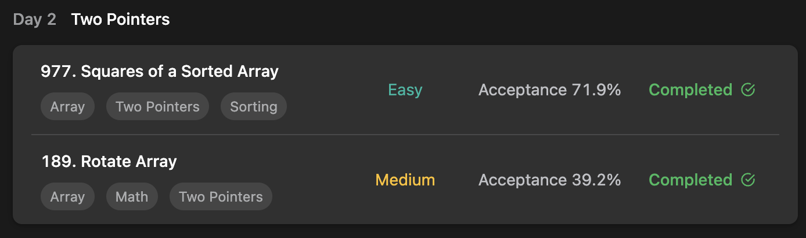

## LeetCode Algorithm StudyPlan



### Day 2

- [977. Squares of a Sorted Array](https://leetcode.com/problems/squares-of-a-sorted-array/?envType=study-plan&id=algorithm-i)
- [189. Rotate Array](https://leetcode.com/problems/rotate-array/?envType=study-plan&id=algorithm-i)

---

#### 977. Squares of a Sorted Array

- **lang**  `kotlin` 
- **tags**  `Array` `Sort` `Two Pointer`

```kotlin
// Basic Solution with first pow all and sort array
class Solution {
    fun sortedSquares(nums: IntArray): IntArray {
        return nums.map { it * it }.sorted().toIntArray()
    }
}
```

```kotlin
// Time-C O(n) Solution with additional array + Two Pointer
class Solution {
    fun sortedSquares(nums: IntArray): IntArray {
        var arr = IntArray(nums.size)
        var l = 0
        var r = nums.size - 1
        var i = nums.size
        while ( i-- > 0) {
            if (Math.abs(nums[l]) < Math.abs(nums[r])) arr.set(i, nums[r] * nums[r--])
            else arr.set(i, nums[l] * nums[l++])
        }
        return arr
    }
}
```

---

#### 189. Rotate Array

- **lang**  `kotlin` 
- **tags**  `Array` , `Extension Function`

```kotlin
// Time-C O(n) Solution with Space-C O(1)
// Just shifting is like partial-reverse
class Solution {
    fun rotate(nums: IntArray, k: Int): Unit {
        val t = k % nums.size
        if (t == 0) return
        // reverse ALl array
        nums.reverse()
        // reverse [0 ~ t-1]
        nums.reverse(0, t-1)
        // reverse [k ~ size-1]
        nums.reverse(t)
    }
    fun IntArray.reverse(start: Int = 0, end: Int = this.size-1) {
        var left = start
        var right = end
        while (left < right) {
            val value = this[right]
            set(right--, this[left])
            set(left++, value)
        }
    }
}
```

---

