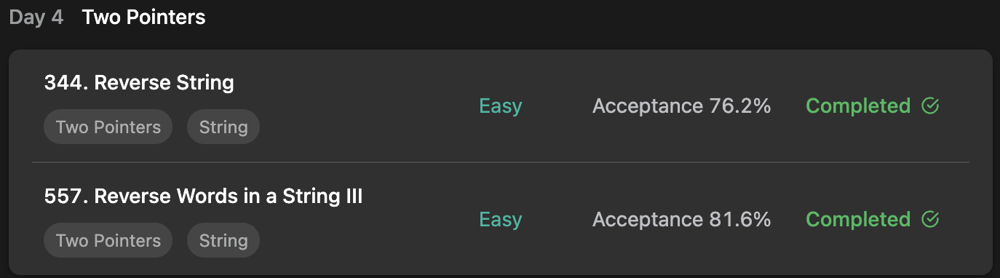

## LeetCode Algorithm StudyPlan



### Day 4

- [344. Reverse String](https://leetcode.com/problems/reverse-string/?envType=study-plan&id=algorithm-i)
- [557. Reverse Words in a String III](https://leetcode.com/problems/reverse-words-in-a-string-iii/?envType=study-plan&id=algorithm-i)

---

#### 344. Reverse String

- **lang**  `kotlin` 
- **tags**  `String`  `Two Pointers`

```kotlin
class Solution {
    fun reverseString(s: CharArray): Unit {
        s.reverseStringPrimitive()
    }
  	// with kotlin native - built in function
    fun CharArray.reverseStringBuiltIn() {
        reverse()
    }
  	// with traditional way with primitive Two Pointer
    fun CharArray.reverseStringPrimitive() {
        var cursor = 0
        val mid = this.size / 2
        while (cursor < mid) {
            val temp = this[this.size-1-cursor]
            this[this.size-1-cursor] = this[cursor]
            this[cursor++] = temp
        }
    }
}
```

---

#### 557. Reverse Words in a String III

- **lang**  `kotlin` 
- **tags**  `Array`  `Two Pointers`

```kotlin
class Solution {
    fun reverseWords(s: String): String {
        return s.reverseWordsBuiltIn()
    }
  	// with kotlin native - built in function
    // it's 10x more memory efficient than with primitive in average.
    fun String.reverseWordsBuiltIn(): String {
        return split(" ").map { it.reversed() }.joinToString(" ")
    }
  	// with traditional way with primitive Two Pointer
    fun String.reverseWordsPrimitive(): String {
        var cursor = 0
        var result = ""
     		// read forward
        while (cursor < this.length) {
          	// if alphabet, ready to read
            if (this[cursor] != ' ') {
                var temp = cursor
                var tempString = ""
              	// to reverse the word, append each character on index 0
                while (temp < this.length && this[temp] != ' ') tempString = this[temp++] + tempString
                result += tempString
                cursor = temp
            } else result += this[cursor++]	// if whitespace, just add
        }
        return result 
    }
}
```

---

