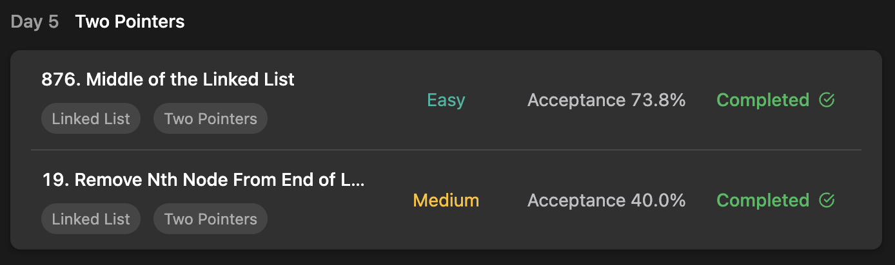

## LeetCode Algorithm StudyPlan



### Day 4

- [876. Middle of the Linked List](https://leetcode.com/problems/middle-of-the-linked-list/?envType=study-plan&id=algorithm-i)
- [19. Remove Nth Node From End of List](https://leetcode.com/problems/remove-nth-node-from-end-of-list/?envType=study-plan&id=algorithm-i)

---

#### 876. Middle of the Linked List

- **lang**  `kotlin` 
- **tags**  `Linked List`  `Two Pointers`

```kotlin
/**
 * Example:
 * var li = ListNode(5)
 * var v = li.`val`
 * Definition for singly-linked list.
 * class ListNode(var `val`: Int) {
 *     var next: ListNode? = null
 * }
 */
class Solution {
    fun middleNode(head: ListNode?): ListNode? {
        return search(head)
    }
    fun search(head: ListNode?): ListNode? {
        // mover = fast pointer, tracker = following pointer
        var mover: ListNode = head ?: return null
        var tracker: ListNode = mover
        // if mover move twice, tracker move once
        var flag = 0
        while (true) {
            flag = (flag + 1) % 2
            if (flag == 0) tracker = tracker.next
            mover = mover.next ?: break
        }
        return tracker
    }
}
```

---

