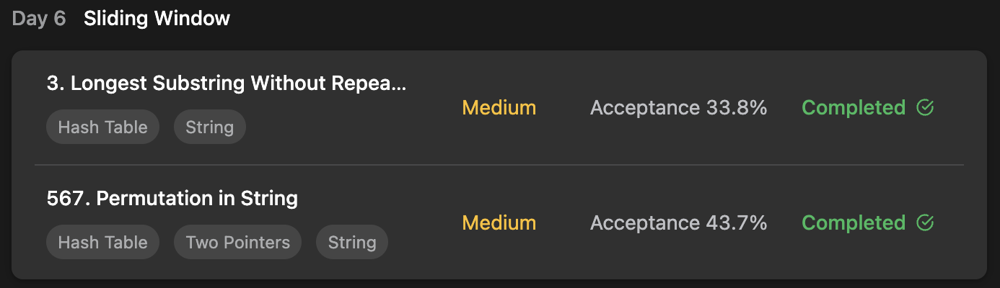

## LeetCode Algorithm StudyPlan



### Day 6

- [3. Longest Substring Without Repeating](https://leetcode.com/problems/longest-substring-without-repeating-characters/?envType=study-plan&id=algorithm-i)
- [567. Permutation in String](https://leetcode.com/problems/permutation-in-string/?envType=study-plan&id=algorithm-i)

---

#### 3. Longest Substring Without Repeating

- **lang**  `kotlin` 
- **tags**  `Hash Table`  `String` `Sliding Window`

```kotlin
class Solution {
    fun lengthOfLongestSubstring(s: String): Int {
        /*
            means length of [last ch ~ current ch]
            so renew area each indexes
        */
        val characterPosition = mutableMapOf<Char, Int>()
        var maxLength = 0
        var start = 0
        s.forEachIndexed { pos, ch ->
            // start = max ( origin start, character last occurrance )
            start = Math.max(start, characterPosition[ch] ?: 0)
            // maxLength = max ( origin max length, current pointer length )
            maxLength = Math.max(maxLength, pos-start+1)
            // renew current character's position
            characterPosition[ch] = 1 + pos
        }
        return maxLength
    }
}
```

---

#### 567. Permutation in String

- **lang**  `kotlin` 
- **tags**  `Hash Table`  `String` `Sliding Window` `Two Pointers`

```kotlin
class Solution {
    fun checkInclusion(s1: String, s2: String): Boolean {
        if (s1.length > s2.length) return false
        // check count of each character ( lowercase alphabet )
        val count = IntArray(26)
        s1.forEach { ch -> count[ch-'a']++ }
        // perform sliding window
        var left = 0
        var right = 0
        var rest = s1.length    // window's rest of width
        while (right < s2.length) {
            // extend window's right
            // if current can consume, reduce rest width
            if (count[s2[right++] - 'a']-- >= 1) rest --
            // if window consume all s1 members, exit
            if (rest == 0) return true
            // reduce window's left ( when right reached window max width )
            if (right-left == s1.length) {
                // if original left can move, increase rest width
                if (count[s2[left++] - 'a']++ >= 0) rest ++
            }
        }
        
        return false
    }
}
```

---

