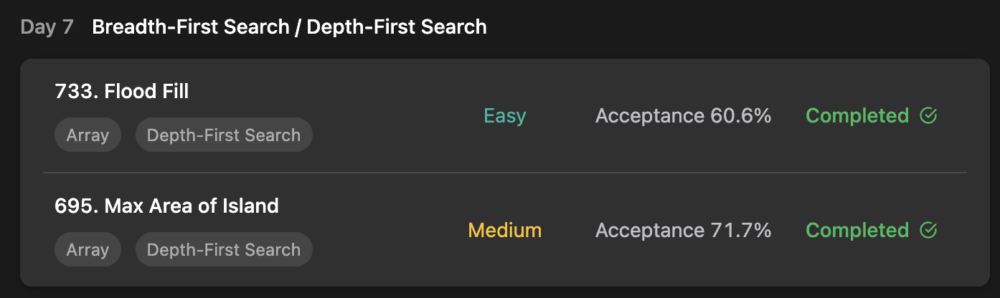

## LeetCode Algorithm StudyPlan



### Day 6

- [733. Flood Fill](https://leetcode.com/problems/flood-fill/?envType=study-plan&id=algorithm-i)
- [695. Max Area of Island](https://leetcode.com/problems/max-area-of-island/?envType=study-plan&id=algorithm-i)

---

#### 733. Flood Fill

- **lang**  `kotlin` 
- **tags**  `Array` `DFS` `BFS` `Matrix` 

```kotlin
class Solution {
    enum class Direction(val x: Int, val y: Int) {
        Up(0, -1),
        Down(0, 1),
        Left(-1, 0),
        Right(1, 0);
    }
    private lateinit var image: Array<IntArray>
    private var color: Int = 0
    private var starting: Int = 0
    fun isInside(dx: Int, dy: Int): Boolean {
        return dx >= 0 && dx < image.size && dy >= 0 && dy < image[0].size
    }
  	/*
  			flood fill condition ( in order )
  			1) current pos is inside
  			2) current pos is same as starting color
  			3) current pos is not yet colored
  	*/
    fun floodFill(image: Array<IntArray>, sr: Int, sc: Int, color: Int): Array<IntArray> {
        this.image = image
        this.color = color
        this.starting = image[sr][sc]
        fillBFS(sr, sc)
        // fillDFS(sr, sc)
        return this.image
    }
  	// process dfs with recursive
    fun fillDFS(x: Int, y: Int) {
        if (isInside(x, y) && image[x][y] == starting && image[x][y] != color) {
            image[x][y] = color
            for (di in Direction.values()) {
                fillDFS(x + di.x, y + di.y)
            }
        }
    }
  	// process bfs with processing queue
    fun fillBFS(sr: Int, sc: Int) {
        val fillQ = mutableListOf<Pair<Int,Int>>(Pair(sr, sc))
        while (!fillQ.isEmpty()) {
            val c = fillQ.get(0)
            fillQ.removeAt(0)
            val x = c.first
            val y = c.second
            if (image[x][y] == color) continue
            image[x][y] = color
            for (di in Direction.values()) {
                val dx = x + di.x
                val dy = y + di.y
                if (isInside(dx, dy) && image[dx][dy] == starting) fillQ.add(Pair(dx, dy))
            }
            
        }
    }
}
```

---

#### 695. Max Area of Island

- **lang**  `kotlin` 
- **tags**  `Array` `DFS` `Matrix` 

```kotlin
class Solution {
    enum class Direction(val x: Int, val y: Int) {
        Up(-1, 0),
        Down(1, 0),
        Left(0, -1),
        Right(0, 1);
    }
    private lateinit var map: Array<IntArray>
    private var group: Int = 2
    
    fun isInside(x: Int, y: Int): Boolean {
        return x >= 0 && x < map.size && y >= 0 && y < map[0].size
    }
    
    fun maxAreaOfIsland(grid: Array<IntArray>): Int {
        map = grid
        var result = 0
        // find partial-island from all map tiles
        for (x in 0..map.size-1) {
            for (y in 0..map[0].size-1) {
                if (map[x][y] == 1) {
                    // count each groups' number of island
                    // group will distinguish island if i already checked
                    val tmp = trackIsland(x, y)
                    result = Math.max(result, tmp)
                    group++
                }
            }
        }
        return result
    }
    fun trackIsland(x: Int, y: Int): Int {
        // if is not inside or tile is (already checked or not island) count 0
        if (!isInside(x, y) || map[x][y] != 1) return 0
        // coloring tile with group number and process 4-direction
        map[x][y] = group
        return 1 +
        trackIsland(x + Direction.Up.x, y + Direction.Up.y) +
        trackIsland(x + Direction.Down.x, y + Direction.Down.y) +
        trackIsland(x + Direction.Left.x, y + Direction.Left.y) +
        trackIsland(x + Direction.Right.x, y + Direction.Right.y)
    }
}
```

---

