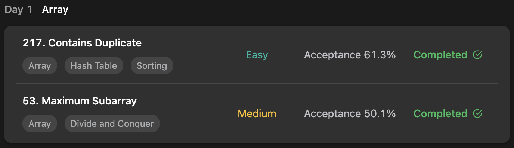

## LeetCode DataStructure StudyPlan



### Day 1

- [217. Contains Duplicate](https://leetcode.com/problems/contains-duplicate/?envType=study-plan&id=data-structure-i)
- [53. Maximum Subarray](https://leetcode.com/problems/maximum-subarray/?envType=study-plan&id=data-structure-i)

---

#### 217. Contains Duplicate

- **lang**  `kotlin` 
- **tags**  `Array` `Hash Table` `Sorting`

```kotlin
class Solution {
    fun containsDuplicate(nums: IntArray): Boolean {
        val memo = mutableSetOf<Int>()
        nums.forEach { c -> 
            // fun MutableSet.add() returns false if it's already in set
            if (!memo.add(c)) return true
        }
        return false
    }
}
```

---

#### 53. Maximum Subarray

- **lang** `kotlin`
- **tags** `Array` `Divide and Conquer` `DP`

```kotlin
import kotlin.math.max
class Solution {
    fun maxSubArray(nums: IntArray): Int {
        /*
            Kadane's algorithm for sum of subarray [ TC : O(n) ]
            1. accumulate each values to summation
            2. if summation is under 0, init to 0 ( for maxSum, magical logic )
        */
        var sum = 0
        var maxSum = Integer.MIN_VALUE
        nums.forEach { num ->
            sum += num
            maxSum = max(maxSum, sum)
            if (sum < 0) sum = 0
        }
        return maxSum
    }
}
```

---

