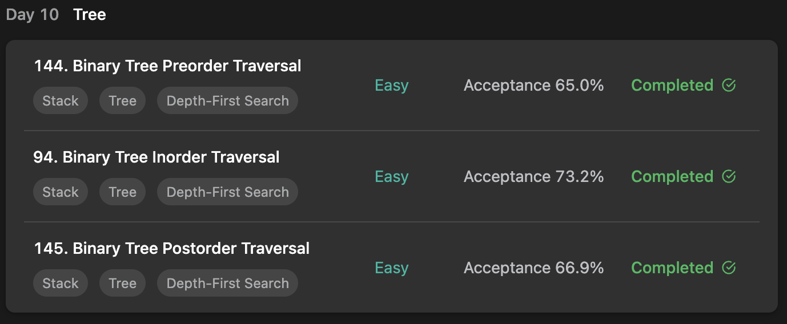

## LeetCode DataStructure StudyPlan



### Day 10

- [144. Binary Tree Preorder Traversal](https://leetcode.com/problems/binary-tree-preorder-traversal/?envType=study-plan&id=data-structure-i)
- [94. Binary Tree Inorder Traversal](https://leetcode.com/problems/binary-tree-inorder-traversal/?envType=study-plan&id=data-structure-i)
- [145. Binary Tree Postorder Traversal](https://leetcode.com/problems/binary-tree-postorder-traversal/?envType=study-plan&id=data-structure-i)

---

#### 144. Binary Tree Preorder Traversal

- **lang**  `kotlin` 
- **tags**  `Stack` `DFS` `Tree` `Binary Tree`

```kotlin
/**
 * Example:
 * var ti = TreeNode(5)
 * var v = ti.`val`
 * Definition for a binary tree node.
 * class TreeNode(var `val`: Int) {
 *     var left: TreeNode? = null
 *     var right: TreeNode? = null
 * }
 */
class Solution {
    fun preorderTraversal(root: TreeNode?): List<Int> {
        // return recursiveDfs(root)
        return iterativeDfs(root)
    }
    /* 
        DFS : Recursive.
        get all left-first traversed list and right traversed list
     */
    fun recursiveDfs(root: TreeNode?): List<Int> {
        root ?: return listOf()
        return listOf(root.`val`) + preorderTraversal(root.left) + preorderTraversal(root.right)
    }
    /*
        DFS : Iterative.
        contrary to BFS with 'Queue', DFS have to use 'Stack'.
     */
    fun iterativeDfs(root: TreeNode?): List<Int> {
        root ?: return listOf()
        val result = mutableListOf<Int>()
        val stack = Stack<TreeNode>()
        stack.add(root)
        // traverse
        while (stack.isNotEmpty()) {
            val node = stack.pop()
            result.add(node.`val`)
            // to traverse first on left, add right first.
            node.right?.let { stack.push(it) }
            node.left?.let { stack.push(it) }
        }
        return result
    }
}
```

---

