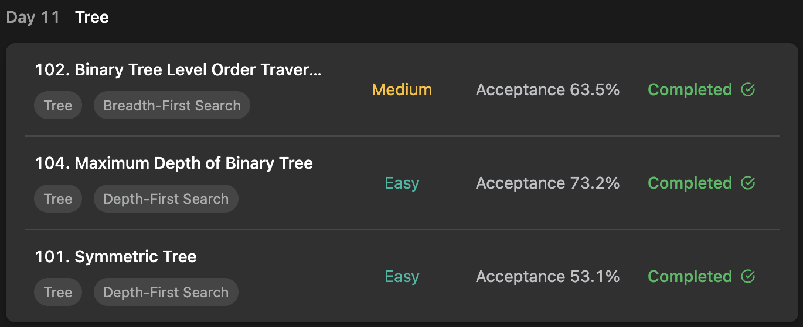

## LeetCode DataStructure StudyPlan



### Day 11

- [102. Binary Tree Level Order Traversal](https://leetcode.com/problems/binary-tree-level-order-traversal/?envType=study-plan&id=data-structure-i)
- [104. Maximum Depth of Binary Tree](https://leetcode.com/problems/maximum-depth-of-binary-tree/?envType=study-plan&id=data-structure-i)
- [101. Symmetric Tree](https://leetcode.com/problems/symmetric-tree/?envType=study-plan&id=data-structure-i)

---

#### 102. Binary Tree Level Order Traversal

- **lang**  `kotlin` 
- **tags**  `Tree` `BFS`  `Binary Tree`

```kotlin
class Solution {
    fun levelOrder(root: TreeNode?): List<List<Int>> {
        // run BFS with queue
        val queue: Queue<TreeNode> = LinkedList<TreeNode>()
        queue.add(root ?: return listOf())
        val result = mutableListOf<List<Int>>()
        // traverse
        while (queue.isNotEmpty()) {
            // initialize each level's container before loop
            val container = mutableListOf<Int>()
            for (i in 0..queue.size-1) {
                // get node from queue and add to container, childs to queue
                val node = queue.poll()
                container.add(node.`val`)
                node.left ?.let { queue.add(it) }
                node.right ?.let { queue.add(it) }
            }
            result.add(container)
        }
        return result
    }
}
```

---

#### 104. Maximum Depth of Binary Tree

- **lang**  `kotlin` 
- **tags**  `Tree` `BFS`  `Binary Tree`

```kotlin
class Solution {
    fun maxDepth(root: TreeNode?): Int {
        // run BFS with queue
        val queue: Queue<TreeNode> = LinkedList<TreeNode>()
        queue.add(root ?: return 0)
        // calculate depth
        var level = 0
        while(queue.isNotEmpty()) {
            // with each loop sequence ended, depth will increment
            for (i in 0..queue.size-1) {
                val node = queue.poll()
                node.left ?.let { queue.add(it) }
                node.right ?.let { queue.add(it) }
            }
            level++
        }
        return level
    }
}
```

---

#### 101. Symmetric Tree

- **lang**  `kotlin` 
- **tags**  `Tree` `BFS`  `Binary Tree`

```kotlin
class Solution {
    /*
        main logic:
        symmetric means "divided half and same with reverse order of counter side."
        so, check each level's left and right node groups and check symmetry.
        // check same of `val`, treat null as OutOfIndexValue.
        (1) ex) if not same : not symmetric
        (2) ex) if same, but null : don't need to check that leaves.
        (3) ex) if same, not null : insert queue to check next level.
     */
    fun isSymmetric(root: TreeNode): Boolean {
        // calculate for root.
        val queue: Queue<TreeNode> = LinkedList<TreeNode>()
        if (isNotSameNode(root.left, root.right)) return false
        if (root.left == null) return true
        queue.add(root.left!!)
        queue.add(root.right!!)
        // traverse
        while(queue.isNotEmpty()) {
            // check each level ( depth )
            for (i in 0..queue.size/2 -1) {
                // poll two counterside nodes and compare
                val first = queue.poll()
                val second = queue.poll()
                // check left-side's left child and right-side's right child 
                if (isNotSameNode(first.left, second.right)) return false
                else if (first.left != null) {
                    queue.add(first.left!!)
                    queue.add(second.right!!)
                }
                // check left-side's right child and right-side's left child
                if (isNotSameNode(first.right, second.left)) return false
                else if (first.right != null) {
                    queue.add(first.right!!)
                    queue.add(second.left!!)
                }
            }
        }
        return true
    }
    /** Calculate function if given node is not same with null handling */
    fun isNotSameNode(n1: TreeNode?, n2: TreeNode?): Boolean {
        return if ((n1?.`val`?: -101) != (n2?.`val`?: -101)) true else false
    }
}
```

---

