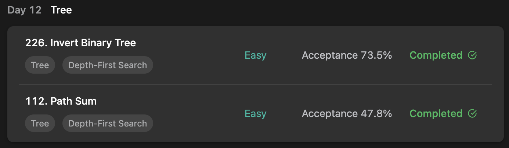

## LeetCode DataStructure StudyPlan



### Day 12

- [226. Invert Binary Tree](https://leetcode.com/problems/invert-binary-tree/?envType=study-plan&id=data-structure-i)
- [112. Path Sum](https://leetcode.com/problems/path-sum/?envType=study-plan&id=data-structure-i)

---

#### 226. Invert Binary Tree

- **lang**  `kotlin` 
- **tags** `Tree` `DFS` `Binary Tree`

```kotlin
class Solution {
    fun invertTree(root: TreeNode?): TreeNode? {
        return dfs(root)
    }
    fun dfs(node: TreeNode?): TreeNode? {
        if (node == null) return null
        // get right and left inversed child nodes
        // set current child as each node - inversed.
        var temp = dfs(node.right)
        node.right = dfs(node.left)
        node.left = temp
        return node
    }
}
```

---

#### 112. Path Sum

- **lang**  `kotlin` 
- **tags** `Tree` `DFS` `Binary Tree`

```kotlin
class Solution {
    fun hasPathSum(root: TreeNode?, targetSum: Int): Boolean {
        // return topDownApproach(root, targetSum)
        return bottomUpApproach(root, targetSum)
    }
    fun topDownApproach(node: TreeNode?, givenSum: Int): Boolean {
        // Top - Down : down to each leaves with rest of each path's sum
        if (node == null) return false
        // leaf : no child at all. if satisfy targetSum, return true.
        if (node.left == null && node.right == null && givenSum == node.`val`) return true
        // if one of paths satisfied targetSum, return true
        return topDownApproach(node.left, givenSum - node.`val`) ||
            topDownApproach(node.right, givenSum - node.`val`)
    }
    fun bottomUpApproach(root: TreeNode?, targetSum: Int): Boolean {
        // get summations from each leaves and check if targetSum exist.
        val fromBottom = bottomUpDfs(root).filter { it == targetSum }
        return if (fromBottom.size > 0) true else false
    }
    fun bottomUpDfs(node: TreeNode?): List<Int> {
        // Bottom - Up : from bottom, get all sums of each possible paths.
        if (node == null) return listOf<Int>()
        // from leaf, create initial list.
        if (node.left == null && node.right == null) return listOf<Int>(node.`val`)
        // get list from child nodes and create each possible sums.
        val fromBottom = mutableListOf<Int>()
        fromBottom.addAll(bottomUpDfs(node.left).map { it + node.`val` })
        fromBottom.addAll(bottomUpDfs(node.right).map { it + node.`val` })
        return fromBottom
    }
}
```

---

