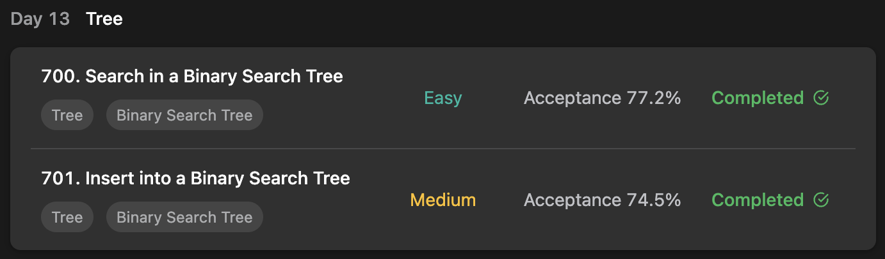

## LeetCode DataStructure StudyPlan



### Day 13

- [700. Search in a Binary Search Tree](https://leetcode.com/problems/search-in-a-binary-search-tree/?envType=study-plan&id=data-structure-i)
- [701. Insert into a Binary Search Tree](https://leetcode.com/problems/insert-into-a-binary-search-tree/?envType=study-plan&id=data-structure-i)

---

#### 700. Search in a Binary Search Tree

- **lang**  `kotlin` 
- **tags** `Tree` `Binary Search Tree` `Binary Tree`

```kotlin
class Solution {
    fun searchBST(root: TreeNode, `val`: Int): TreeNode? {
        // with Queue, run BFS
        val queue: Queue<TreeNode> = LinkedList<TreeNode>()
        queue.add(root)
        // traverse
        while (queue.isNotEmpty()) {
            for (i in 0..queue.size-1) {
                val node = queue.poll()
                // if find given number, return the node.
                if (node.`val` == `val`) return node
                // else, continue BFS
                node.left ?.let { queue.add(it) }
                node.right ?.let { queue.add(it) }
            }
        }
        return null
    }
}
```

---

#### 701. Insert into a Binary Search Tree

- **lang**  `kotlin` 
- **tags** `Tree` `Binary Search Tree` `Binary Tree`

```kotlin
class Solution {
    fun insertIntoBST(root: TreeNode?, `val`: Int): TreeNode? {
        return dfs(root, `val`)
    }
    fun dfs(node: TreeNode?, value: Int): TreeNode? {
        // if reach at impossible-path, return new Node with given value
        if (node == null) return TreeNode(value)
        // if current node is smaller than given value, throw to left
        // or bigger, throw to right.
        // or same, it's already in tree.
        if (node.`val` > value) node.left = dfs(node.left, value)
        else if (node.`val` < value) node.right = dfs(node.right, value)
        return node
    }
}
```

---

