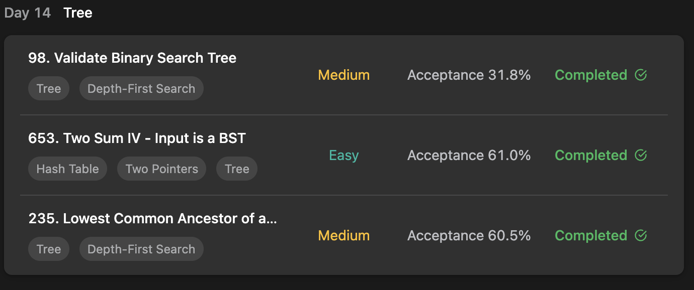
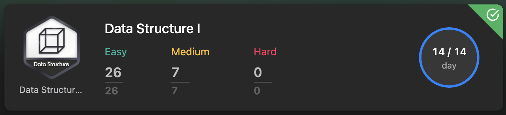

## LeetCode Algorithm StudyPlan





### Day 14

- [98. Validate Binary Search Tree](https://leetcode.com/problems/validate-binary-search-tree/?envType=study-plan&id=data-structure-i)
- [653. Two Sum IV - Input is a BST](https://leetcode.com/problems/two-sum-iv-input-is-a-bst/?envType=study-plan&id=data-structure-i)
- [235. Lowest Common Ancestor of a Binary Search Tree](https://leetcode.com/problems/lowest-common-ancestor-of-a-binary-search-tree/?envType=study-plan&id=data-structure-i)

---

#### 98. Validate Binary Search Tree

- **lang**  `kotlin` 
- **tags**  `Tree` `DFS` `Binary Tree` 

```kotlin
class Solution {
    fun isValidBST(root: TreeNode): Boolean {
        return dfs(root, Long.MIN_VALUE, Long.MAX_VALUE)
    }
    fun dfs(node: TreeNode?, mini: Long, maxi: Long): Boolean {
        if (node == null) return true
        // node must in range of current path's min and max values.
        if (node.`val` >= maxi || node.`val` <= mini) return false
        // left subtree's : min = given min, max = current node's value.
        // right subtree's : min = current node's value, max = given max
        return dfs(node.left, mini, node.`val`.toLong()) && dfs(node.right, node.`val`.toLong(), maxi)
    } 
}
```

---

#### 653. Two Sum IV - Input is a BST

- **lang**  `kotlin` 
- **tags**  `Tree` `BFS` `Binary Tree` `Binary Search Tree` `Hash Table`

```kotlin
class Solution {
    fun findTarget(root: TreeNode, k: Int): Boolean {
        // with Queue, run BFS
        val checkSum = mutableSetOf<Int>()
        val queue: Queue<TreeNode> = LinkedList<TreeNode>()
        queue.add(root)
        // traverse
        while(queue.isNotEmpty()) {
            for (i in 0..queue.size-1) {
                val node = queue.poll()
                // if counterpart exists, it can be matched !
                if (checkSum.contains(k - node.`val`)) return true
                // ready to meet counterpart.
                checkSum.add(node.`val`)
                node.left?.let { queue.add(it) }
                node.right?.let { queue.add(it) }
            }
        }
        return false
    }
}
```

---

#### 235. Lowest Common Ancestor of a Binary Search Tree

- **lang**  `kotlin` 
- **tags**  `Tree` `DFS` `Binary Tree` 

```kotlin
class Solution {
    fun lowestCommonAncestor(root: TreeNode?, p: TreeNode?, q: TreeNode?): TreeNode? {
        return dfs(root, p!!, q!!)
    }
    fun dfs(node: TreeNode?, p: TreeNode, q: TreeNode): TreeNode? {
        if (node == null) return null
        /*
            BST rule ( l-sub is smaller than node, r-sub is bigger than node)
            (1) if p, q both smaller than node : down to left subtree
            (2) if p, q both bigger than node : down to right subtree
            (3) else can't down. It's Lowest Common Ancestor
         */
        if (node.`val` > p.`val` && node.`val` > q.`val`) return dfs(node.left, p, q)
        else if (node.`val` < p.`val` && node.`val` < q.`val`) return dfs(node.right, p, q)
        else return node
    }
}
```

---

