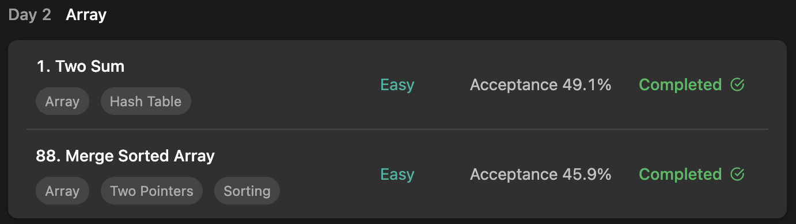

## LeetCode DataStructure StudyPlan



### Day 2

- [1. Two Sum](https://leetcode.com/problems/two-sum/?envType=study-plan&id=data-structure-i)
- [88. Merge Sorted Array](https://leetcode.com/problems/merge-sorted-array/?envType=study-plan&id=data-structure-i)

---

#### 1. Two Sum

- **lang**  `kotlin` 
- **tags**  `Array` `Hash Table` 

```kotlin
class Solution {
    fun twoSum(nums: IntArray, target: Int): IntArray? {
        // memorize each num with index
        val valueMap = mutableMapOf<Int, Int>()
        // traverse
        nums.forEachIndexed { idx, num ->
            // if (target-num) exists, find pair.
            // else memorize current num.
            if (valueMap.contains(target - num)) return intArrayOf(valueMap[target-num]!!, idx)
            else valueMap[num] = idx
        }
        return null
    }
}
```

---

#### 88. Merge Sorted Array

- **lang** `kotlin`
- **tags** `Array` `Two Pointers` `Sorting`

```kotlin
class Solution {
    fun merge(nums1: IntArray, m: Int, nums2: IntArray, n: Int): Unit {
        /*
            arrange merged elements backward
            move each two pointers to compare
         */
        var (l, r) = m - 1 to n - 1
        var cursor = m + n - 1
        // traverse
        while (l >= 0 && r >= 0) {
            // if nums2's element is bigger, assign num2's and move r pointer
            // else, assign num1's and move l pointer
            if (nums1[l] < nums2[r]) nums1[cursor--] = nums2[r--]
            else nums1[cursor--] = nums1[l--]
        }
        // consume last num2's elements. num1's already sorted, so don't need to assign
        while (r >= 0) nums1[cursor--] = nums2[r--]
    }
}
```

---

