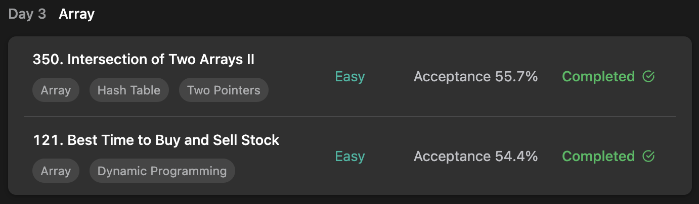

## LeetCode DataStructure StudyPlan



### Day 3

- [350. Intersection of Two Arrays II](https://leetcode.com/problems/intersection-of-two-arrays-ii/?envType=study-plan&id=data-structure-i)
- [121. Best Time to Buy and Sell Stock](https://leetcode.com/problems/best-time-to-buy-and-sell-stock/?envType=study-plan&id=data-structure-i)

---

#### 350. Intersection of Two Arrays II

- **lang**  `kotlin` 
- **tags**  `Array` `Hash Table` `Two Pointers` `Binary Search` `Sorting`

```kotlin
class Solution {
    fun intersect(nums1: IntArray, nums2: IntArray): IntArray {
        val map = mutableMapOf<Int, Int>()
        val result = mutableListOf<Int>()
        // memorize each num occurs in nums1
        nums1.forEachIndexed { idx, num ->
            map[num] = (map[num] ?: 0) + 1
        }
        // check each num occurs in nums2
        nums2.forEachIndexed { idx, num ->
            // if rest count of num > 0, add to result
            if ((map[num] ?: 0) > 0) {
                map[num] = map[num]!! - 1
                result.add(num)
            }
        }
        return result.toIntArray()
    }
}
```

---

#### 121. Best Time to Buy and Sell Stock

- **lang** `kotlin`
- **tags** `Array` `DP`

```kotlin
import kotlin.math.max
class Solution {
    fun maxProfit(prices: IntArray): Int {
        // use Kadane's algorithm. ( max sum of subarray )
        var profit = 0
        var maxProfit = 0
        // traverse
        for (i in 1..prices.size-1) {
            // if current < before, assign 0 ( can't get profit )
            profit = max(0, profit + (prices[i] - prices[i-1]))
            // refresh maxProfit each calculation
            maxProfit = max(profit, maxProfit)
        }
        return maxProfit
    }
}
```

---

