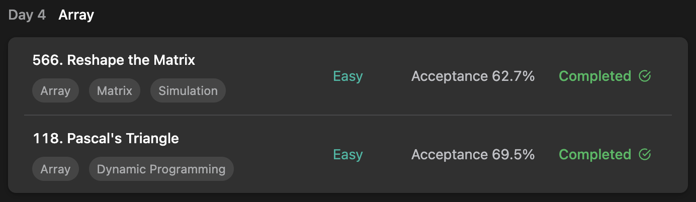

## LeetCode DataStructure StudyPlan



### Day 4

- [566. Reshape the Matrix](https://leetcode.com/problems/reshape-the-matrix/?envType=study-plan&id=data-structure-i)
- [118. Pascal's Triangle](https://leetcode.com/problems/pascals-triangle/?envType=study-plan&id=data-structure-i)

---

#### 566. Reshape the Matrix

- **lang**  `kotlin` 
- **tags**  `Array` `Matrix` `Simulation`

```kotlin
class Solution {
    fun matrixReshape(mat: Array<IntArray>, r: Int, c: Int): Array<IntArray> {
        // if given matrix is nonshapeable, return itself
        if (mat.size * mat[0].size != r * c) return mat
        // setup base tracking variables
        var row = 0
        var column = 0
        var result = arrayOf<IntArray>()
        for(i in 1..r) result += IntArray(c)
        // traverse
        mat.forEach { matRow ->
            matRow.forEach { value ->
                // set current value as transformed location
                result[row][column] = value
                // if reached to each columns' end, change row.
                if (++column == c) {
                    row ++
                    column = 0
                }
            }
        }
        return result
    }
}
```

---

