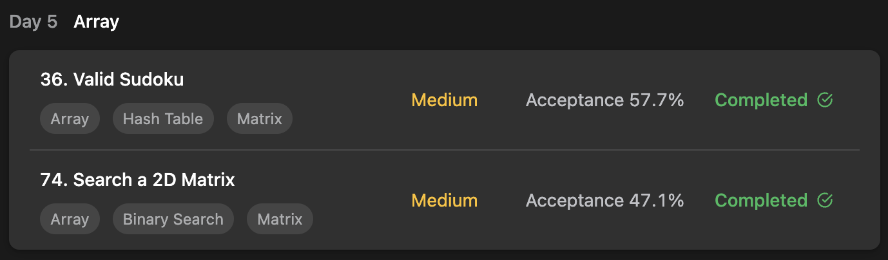

## LeetCode DataStructure StudyPlan



### Day 5

- [36. Valid Sudoku](https://leetcode.com/problems/valid-sudoku/?envType=study-plan&id=data-structure-i)
- [74. Search a 2D Matrix](https://leetcode.com/problems/search-a-2d-matrix/?envType=study-plan&id=data-structure-i)

---

#### 36. Valid Sudoku

- **lang**  `kotlin` 
- **tags**  `Array` `Matrix` `Hash Table`

```kotlin
class Solution {
    fun isValidSudoku(board: Array<CharArray>): Boolean {
        val checkSet = mutableSetOf<String>()
        // traverse
        board.forEachIndexed { row, rowData ->
            rowData.forEachIndexed { col, value ->
                // if is treatable number
                if (value != '.') {
                    /*
                        it's difficult to distinguish each rule, so build as string.
                        (1) no same value in row
                        (2) no same value in col
                        (3) no same value in box ( rowNum, colNum )
                     */
                    if (
                        !checkSet.add("$value/row/$row") ||
                        !checkSet.add("$value/col/$col") ||
                        !checkSet.add("$value/box/${row/3},${col/3}")
                    ) return false
                }
            }
        }
        return true
    }
}
```

---

