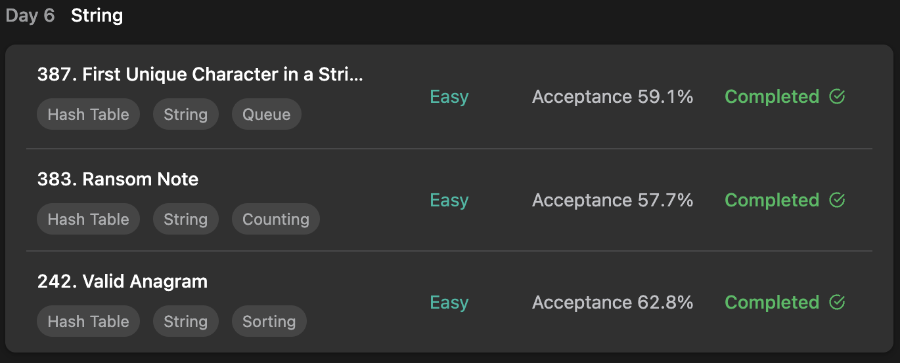

## LeetCode DataStructure StudyPlan



### Day 6

- [387. First Unique Character in a String](https://leetcode.com/problems/first-unique-character-in-a-string/?envType=study-plan&id=data-structure-i)
- [383. Ransom Note](https://leetcode.com/problems/ransom-note/?envType=study-plan&id=data-structure-i)
- [242. Valid Anagram](https://leetcode.com/problems/valid-anagram/?envType=study-plan&id=data-structure-i)

---

#### 387. First Unique Character in a String

- **lang**  `kotlin` 
- **tags**  `String` `Counting` `Hash Table`

```kotlin
class Solution {
    fun firstUniqChar(s: String): Int {
        // memorize count of each character
        val count = mutableMapOf<Char, Int>()
        s.forEachIndexed { idx, value -> 
            if (count.contains(value)) count[value] = -1
            else count[value] = idx
        }
        // find first letter with count 1
        // use filtered sequence and get first unique character
        return count.filterValues { it >= 0 }.toList().firstOrNull()?.second ?: -1
    }
}
```

---

#### 383. Ransom Note

- **lang**  `kotlin` 
- **tags**  `String` `Counting` `Hash Table`

```kotlin
class Solution {
    fun canConstruct(ransomNote: String, magazine: String): Boolean {
        // count each character
        val count = IntArray(26)
        magazine.forEach { value -> count[value - 'a'] += 1 }
        // if current count is 0, unconstructable
        ransomNote.forEach { value -> 
            if (count[value - 'a']-- == 0) return false
        }
        return true
    }
}
```

---

