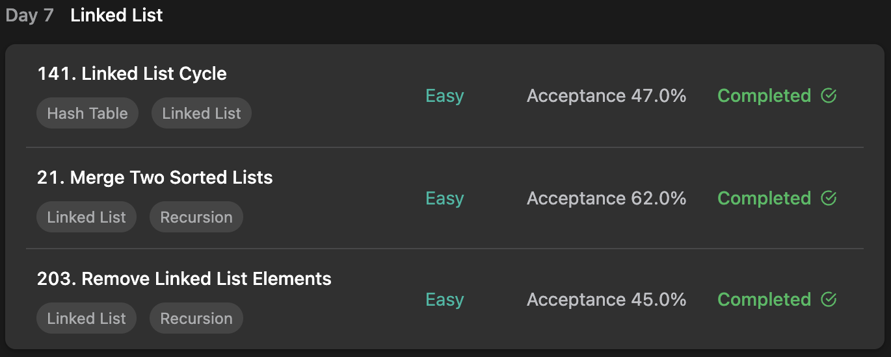

## LeetCode DataStructure StudyPlan



### Day 7

- [141. Linked List Cycle](https://leetcode.com/problems/linked-list-cycle/?envType=study-plan&id=data-structure-i)
- [21. Merge Two Sorted Lists](https://leetcode.com/problems/merge-two-sorted-lists/?envType=study-plan&id=data-structure-i)
- [203. Remove Linked List Elements](https://leetcode.com/problems/remove-linked-list-elements/?envType=study-plan&id=data-structure-i)

---

#### 141. Linked List Cycle

- **lang**  `kotlin` 
- **tags**  `Hash Table` `Linked List` `Two Pointers`

```kotlin
class Solution {
    fun hasCycle(head: ListNode?): Boolean {
        // like two pointers, two node cursor used.
        var fast = head
        var slow = head
        // if fast-forward cursor is pointing same node with following cursor,
        // it means cycle exists in linked list.
        while (fast != null && fast?.next != null) {
            fast = fast?.next?.next
            slow = slow?.next
            if (fast == slow) return true
        }
        return false
    }
}
```

---

#### 21. Merge Two Sorted Lists

- **lang**  `kotlin` 
- **tags**  `Recursion` `Linked List`

```kotlin
class Solution {
    fun mergeTwoLists(list1: ListNode?, list2: ListNode?): ListNode? {
        // dummy node for merge starter
        val start = ListNode(0)
        // writer pointer and reader (list1, list2) pointers
        var writer = start
        var reader1 = list1
        var reader2 = list2
        // compare each reader's current node and attach to writer node
        while (reader1 != null && reader2 != null) {
            if (reader1.`val` < reader2.`val`) {
                writer.next = ListNode(reader1.`val`)
                reader1 = reader1.next
            } else {
                writer.next = ListNode(reader2.`val`)
                reader2 = reader2.next
            }
            writer = writer.next
        }
        // if one's cursor ended, attach rest of another to writer node.
        if (reader1 == null) writer.next = reader2
        else if (reader2 == null) writer.next = reader1
        // return writer node's root except for dummy node.
        return start.next
    }
}
```

---

#### 203. Remove Linked List Elements

- **lang**  `kotlin` 
- **tags**  `Recursion` `Linked List`

```kotlin
class Solution {
    fun removeElements(head: ListNode?, `val`: Int): ListNode? {
        // initialize variables
        var root = ListNode(0)
        var writer = root
        var reader = head
        // traverse
        while (reader != null) {
            // if current read value is not same with given paramter, add it
            if (reader.`val` != `val`) {
                writer.next = ListNode(reader.`val`)
                writer = writer.next
            }
            reader = reader.next
        }
        return root.next
    }
}
```

---

