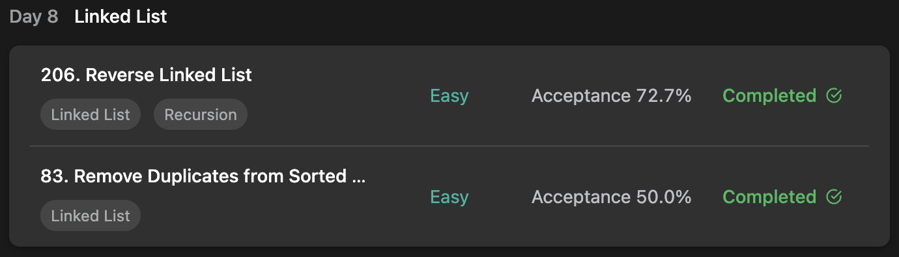

## LeetCode DataStructure StudyPlan



### Day 8

- [206. Reverse Linked List](https://leetcode.com/problems/reverse-linked-list/?envType=study-plan&id=data-structure-i)
- [83. Remove Duplicates from Sorted List](https://leetcode.com/problems/remove-duplicates-from-sorted-list/?envType=study-plan&id=data-structure-i)

---

#### 206. Reverse Linked List

- **lang**  `kotlin` 
- **tags** `Linked List` `Recursion`

```kotlin
class Solution {
    fun reverseList(head: ListNode?): ListNode? {
        // traverse
        return dfs(null, head)
    }
    fun dfs(node: ListNode?, reader: ListNode?): ListNode? {
        // if no more readable node exist, return constructed.
        if (reader == null) return node
        // construct new node with read value and attach constructed to backward
        val new = ListNode(reader.`val`)
        new.next = node
        return dfs(new, reader.next)
    }
}
```

---

#### 83. Remove Duplicates from Sorted List

- **lang**  `kotlin` 
- **tags** `Linked List`

```kotlin
class Solution {
    fun deleteDuplicates(head: ListNode?): ListNode? {
        // possible given-`val`s in range of -100, 100
        val root = ListNode(-101)
        var writer = root
        var reader = head
        // traverse
        while (reader != null) {
            // if already read value, pass it else attach as new node
            if (writer.`val` != reader.`val`) {
                writer.next = ListNode(reader.`val`)
                writer = writer.next
            }
            reader = reader.next
        }
        return root.next
    }
}
```

---

