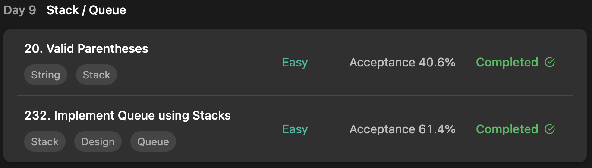

## LeetCode DataStructure StudyPlan



### Day 9

- [20. Valid Parentheses](https://leetcode.com/problems/valid-parentheses/?envType=study-plan&id=data-structure-i)
- [232. Implement Queue using Stacks](https://leetcode.com/problems/implement-queue-using-stacks/?envType=study-plan&id=data-structure-i)

---

#### 20. Valid Parentheses

- **lang**  `kotlin` 
- **tags** `String` `Stack`

```kotlin
class Solution {
    fun isValid(s: String): Boolean {
        val stack = Stack<Char>()
        // traverse
        s.forEach { c ->
            // if open-bracket, add to stack.
            if (c == '(' || c == '{' || c == '[') stack.push(c)
            else {
                // avoid EmptyStackException
                if (stack.isEmpty()) return false
                // if close-bracket, check matches with top of stack.
                val bracket = stack.pop()
                if (
                    !((c == ')' && bracket == '(') ||
                    (c == '}' && bracket == '{') ||
                    (c == ']' && bracket == '['))
                ) return false
            }
        }
        return stack.isEmpty()
    }
}
```

---

#### 232. Implement Queue using Stacks

- **lang**  `kotlin` 
- **tags** `Stack` `Design` `Queue`

```kotlin
class MyQueue() {
    // implements queue using 2 stacks
    private val front = Stack<Int>()
    private val back = Stack<Int>()
    // front-forward, move all elements in back to front. and newly push.
    fun push(x: Int) {
        while (back.isNotEmpty()) front.push(back.pop())
        front.push(x)
    }
    // back-forward, move all elements in front to back. return pop() of back.
    fun pop(): Int {
        while (front.isNotEmpty()) back.push(front.pop())
        return back.pop()
    }
    // back-forward, move all elements in front to back. return peek() of back.
    fun peek(): Int {
        while (front.isNotEmpty()) back.push(front.pop())
        return back.peek()
    }
    // check are front and back stack all empty.
    fun empty(): Boolean = front.isEmpty() && back.isEmpty()
}
```

---

