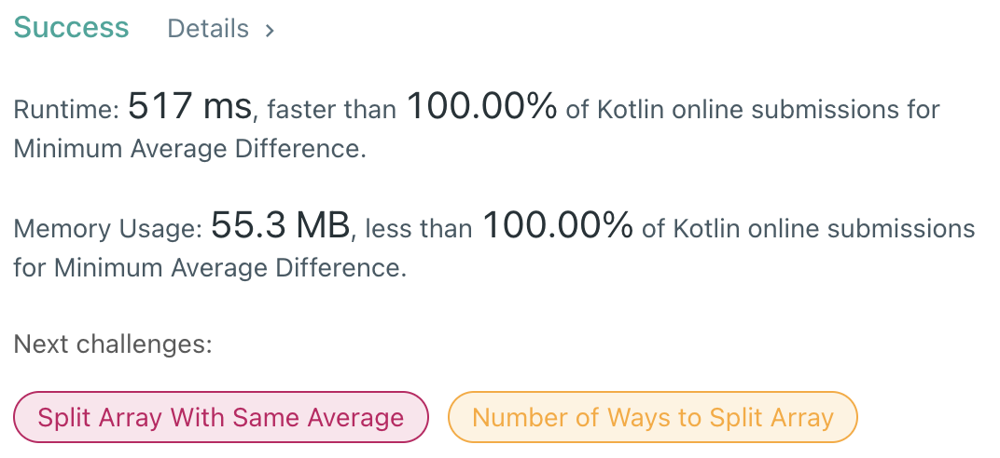

## LeetCode Problems

##### First User solve with kotlin.

> No one used kotlin for solving this..



#### 151. Reverse Words in a String

- **link**  [2256. Minimum Average Difference](https://leetcode.com/problems/minimum-average-difference/)

- **lang**  `kotlin` 
- **tags**  `Array` `Prefix Sum` 

```kotlin
import kotlin.math.*
class Solution {
    fun minimumAverageDifference(nums: IntArray): Int {
        // prepare for prefix sum from left to right
        val len = nums.size
        var leftSum: Long = 0
        var rightSum: Long = nums.map { it.toLong() }.sum()
        // result maker with min absolute diff & idx
        var minDiff: Long = -1
        var result = 0
        // traverse
        nums.forEachIndexed { idx, value -> 
            // add this to leftSum & sub this to rightSum
            leftSum += value
            val leftAvg = leftSum / (idx+1)
            rightSum -= value
            val rightAvg = if (idx == len-1) 0 else rightSum / (len-idx-1)
            // if current diff is minDiff, this idx is answer
            val diff = abs(leftAvg-rightAvg)
            if (minDiff == -1L) {
                minDiff = diff
                result = idx
            } else if (diff < minDiff) {
                minDiff = diff
                result = idx
            }
        }
        return result
    }
}
```

---

