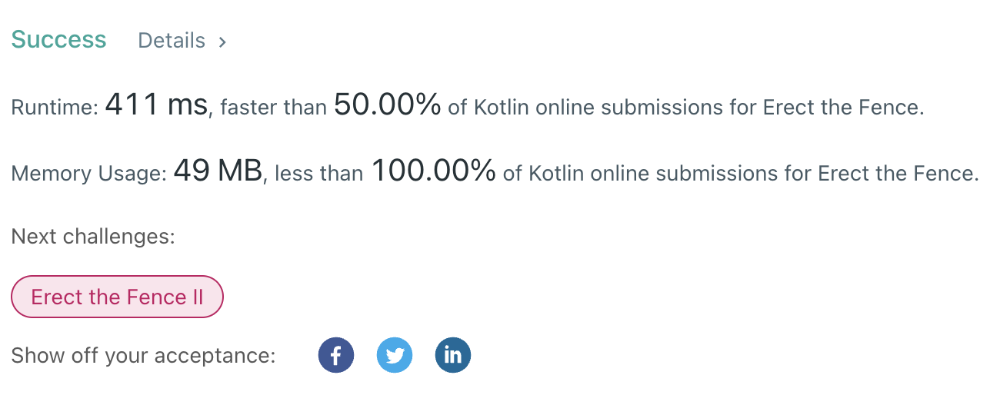

## LeetCode Problems

##### Memory Usage first prize

> I know there're many conditions when evaluating submission in leetcode, it's not a absolute evaluation.
>
> Eventhough i used custom data class for readabilities of codes, 100% beat in memory usage! XD



#### 

#### 587. Erect the Fence

- **link**  [587. Erect the Fence](https://leetcode.com/problems/erect-the-fence/)

- **lang**  `kotlin` 
- **tags** `Array` `Math` `Geometry`

```kotlin
class Solution {
    // each point as object for readability
    data class Tree(
        val x: Int,
        val y: Int
    ) {
        fun toIntArray(): IntArray {
            return intArrayOf(x, y)
        }
    }
    
    fun outerTrees(trees: Array<IntArray>): Array<IntArray> {
        // track trees in x-order
        val treeArray = trees.sortedWith(compareBy({it[0]}, {it[1]})).map { Tree(it[0], it[1]) }
        /*
            check fences as two bounds
            /upper\ 
            -------
            \lower/
        */
        val inLowers = Stack<Tree>()
        val inUppers = Stack<Tree>()
        treeArray.forEachIndexed { idx, tree ->
            // if incline state ? last is not in lower bound
            while (inLowers.size >= 2 && calcInclination(inLowers[inLowers.size-2], inLowers.peek(), tree) > 0) inLowers.pop()
            // if decline state ? last is not in upper bound
            while (inUppers.size >= 2 && calcInclination(inUppers[inUppers.size-2], inUppers.peek(), tree) < 0) inUppers.pop()
            
            inLowers.add(tree)
            inUppers.add(tree)
        }
        val set = mutableSetOf<Tree>().apply {
            addAll(inLowers)
            addAll(inUppers)
        }
        return set.map { it.toIntArray() } .toTypedArray()
    }
    /*
        calc connected 2 line inclination state
        < 0 : in incline state
        = 0 : same inclination = direct line
        > 0 : in decline state
    */
    fun calcInclination(t1: Tree, t2: Tree, t3: Tree): Int {
        return (t3.y - t2.y) * (t2.x - t1.x) - (t2.y - t1.y) * (t3.x - t2.x)
    }
}
```

---

