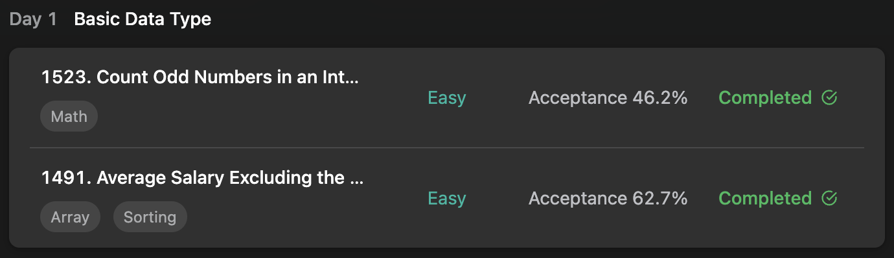

## LeetCode Algorithm StudyPlan



### Day 1

- [1523. Count Odd Numbers in an Inter](https://leetcode.com/problems/count-odd-numbers-in-an-interval-range/?envType=study-plan&id=programming-skills-i)
- [1491. Average Salary Excluding the M](https://leetcode.com/problems/average-salary-excluding-the-minimum-and-maximum-salary/?envType=study-plan&id=programming-skills-i)

---

#### 1523. Count Odd Numbers in an Interval Range

- **lang**  `kotlin` 
- **tags**  `math`

```kotlin
class Solution {
    fun countOdds(low: Int, high: Int): Int {
        /*
            n's odd count = (n + 1)/2
            1 ~ < low : low/2
            1 ~ <= high : (high+1)/2
        */
        return (high+1) / 2 - low / 2
    }
}
```

---

#### 1491. Average Salary Excluding the Minimum and Maximum Salary

- **lang** `kotlin`
- **tags** `Binary Search`

```kotlin
class Solution {
    fun average(salary: IntArray): Double {
        var minSal = 1000001
        var maxSal = 0
        var result: Double = 0.0
        /*
            first, add salary of all and process below.
            (1) if min renewed, origin min add and subtract this + assign this to min
            (2) if max renewed, origin max add and subtract this + assign this to max
            --- return (summation) / (size-2)
        */
        salary.forEach { sal ->
            result += sal
            if (sal < minSal) {
                result += minSal
                result -= sal
                minSal = sal
            }
            if (sal > maxSal) {
                result += maxSal
                result -= sal
                maxSal = sal
            }
        }
        return (result - 1000001) / (salary.size-2)
    }
}
```

---

#### 