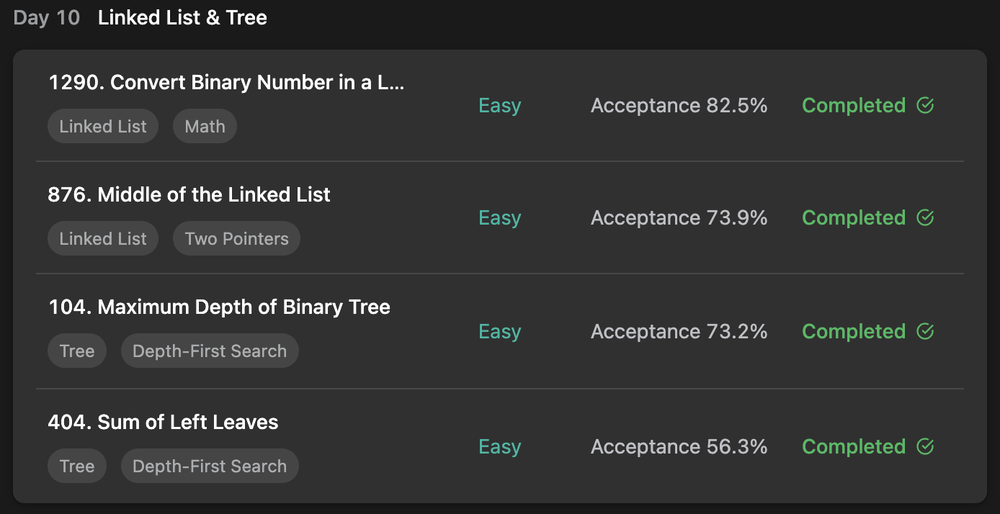

## LeetCode ProgrammingSkills StudyPlan



### Day 10

- [1290. Convert Binary Number in a Linked List to Integer](https://leetcode.com/problems/convert-binary-number-in-a-linked-list-to-integer/?envType=study-plan&id=programming-skills-i)
- [876. Middle of the Linked List](https://leetcode.com/problems/middle-of-the-linked-list/?envType=study-plan&id=programming-skills-i)
- [104. Maximum Depth of Binary Tree](https://leetcode.com/problems/maximum-depth-of-binary-tree/?envType=study-plan&id=programming-skills-i)
- [404. Sum of Left Leaves](https://leetcode.com/problems/sum-of-left-leaves/?envType=study-plan&id=programming-skills-i)

---

#### 1290. Convert Binary Number in a Linked List to Integer

- **lang**  `kotlin` 
- **tags**  `LinkedList` `Math`

```kotlin
/**
 * Example:
 * var li = ListNode(5)
 * var v = li.`val`
 * Definition for singly-linked list.
 * class ListNode(var `val`: Int) {
 *     var next: ListNode? = null
 * }
 */
class Solution {
    fun getDecimalValue(head: ListNode?): Int {
        var result = 0
        var node = head
        // add `val` from each node and shift left to make result
        while(node != null) {
            result = result.shl(1) + node.`val`
            node = node.next
        }
        return result
    }
}
```

---

