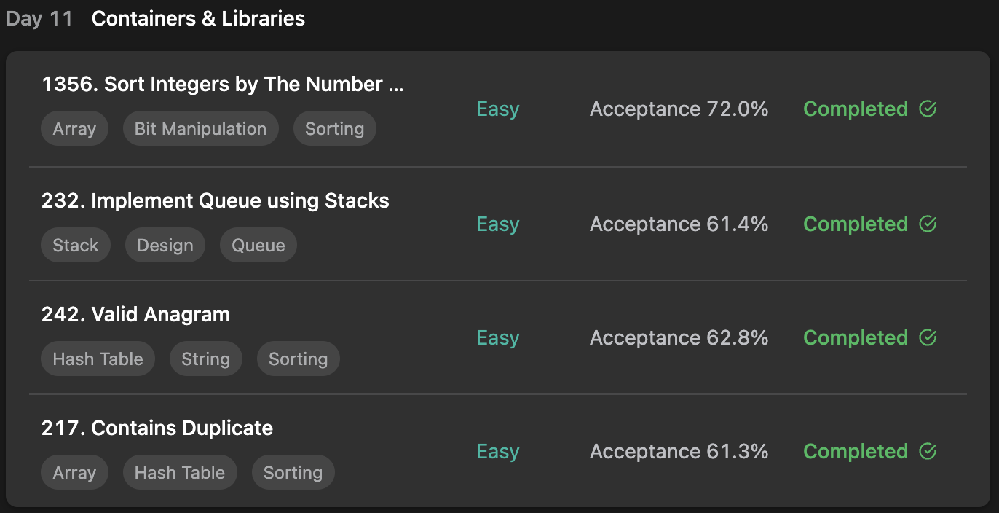

## LeetCode ProgrammingSkills StudyPlan



### Day 11

- [1356. Sort Integers by The Number of 1 Bits](https://leetcode.com/problems/sort-integers-by-the-number-of-1-bits/?envType=study-plan&id=programming-skills-i)
- [232. Implement Queue using Stacks](https://leetcode.com/problems/implement-queue-using-stacks/?envType=study-plan&id=programming-skills-i)
- [242. Valid Anagram](https://leetcode.com/problems/valid-anagram/?envType=study-plan&id=programming-skills-i)
- [217. Contains Duplicate](https://leetcode.com/problems/contains-duplicate/?envType=study-plan&id=programming-skills-i)

---

#### 1356. Sort Integers by The Number of 1 Bits

- **lang**  `kotlin` 
- **tags**  `Array` `Bit Manipulation` `Sorting` `Counting`

```kotlin
class Solution {
    fun sortByBits(arr: IntArray): IntArray {
        // for ascending ordered result
        arr.sort()
        // count bit each, and add to counted list
        val map = mutableMapOf<Int, MutableList<Int>>()
        arr.forEach { value -> 
            val count = value.getBitCount()
            map[count]
                ?.let { map[count]!!.add(value) }
                ?:run { map[count] = mutableListOf<Int>(value) }
        }
        // merge counted list for result
        var result = intArrayOf()
        map.keys.sorted().forEach { result += map[it]!!.toIntArray() }
        return result
    }
    fun Int.getBitCount(): Int {
        var count = 0
        var buff = this
        // check each first bit and shift right
        while (buff > 0) {
            count += buff.and(1)
            buff = buff.shr(1)
        }
        return count
    }
}
```

---

