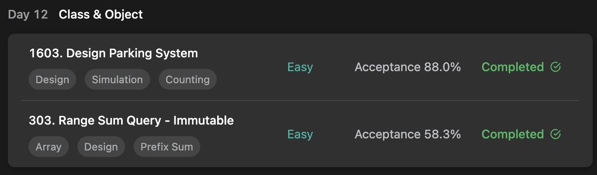
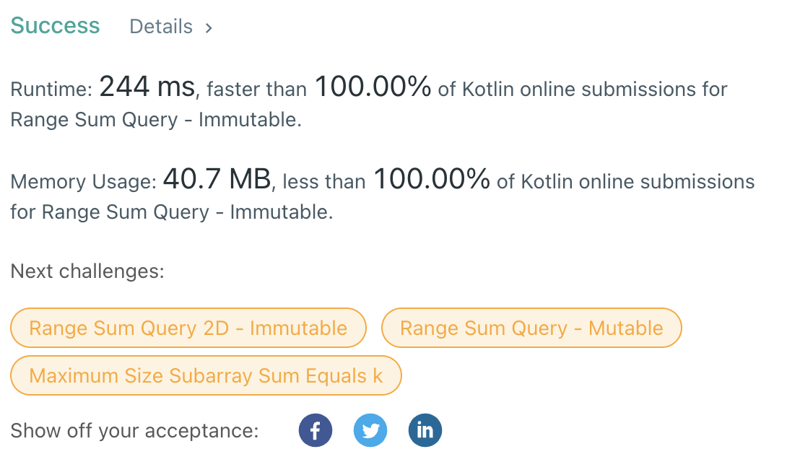

## LeetCode ProgrammingSkills StudyPlan



**( 303 ) Beats 100% !!!**

> Beat 100% in Time / Space complexity on Kotlin solvers !!!



### Day 12

- [1603. Design Parking System](https://leetcode.com/problems/design-parking-system/?envType=study-plan&id=programming-skills-i)
- [303. Range Sum Query - Immutable](https://leetcode.com/problems/range-sum-query-immutable/?envType=study-plan&id=programming-skills-i)

---

#### 1603. Design Parking System

- **lang**  `kotlin` 
- **tags**  `Design` `Simulation` `Counting`

```kotlin
class ParkingSystem(big: Int, medium: Int, small: Int) {
    // private parkingLot (not to be expose)
    private val parkingLot = intArrayOf(big, medium, small)
    fun addCar(carType: Int): Boolean {
        // if parkingLot has empty space for the carType, park the car.
        return if (parkingLot[carType - 1] == 0) false 
        else {
            parkingLot[carType - 1]--
            true
        }
    }
}
```

---

#### 303. Range Sum Query - Immutable

- **lang**  `kotlin` 
- **tags**  `Array` `Design` `Prefix Sum`

```kotlin
class NumArray(nums: IntArray) {
    /*
        using pre-built array with (summation from 0 to current idx)
    */
    private lateinit var sums: IntArray
    init {
        var sum = 0
        sums = IntArray(nums.size + 1)
        // for usability calc inclusive sum
        sums[0] = 0
        // register each index's summation
        for (i in 0..nums.size-1) {
            sum += nums[i]
            sums[i+1] = sum
        }
    }
    fun sumRange(left: Int, right: Int): Int {
        // inclusive sum
        // sums[idx+1] = 0 ~ idx 's sum, sum[idx] = 0 ~ idx-1 's sum
        return sums[right+1] - sums[left]
    }
}
```

---

