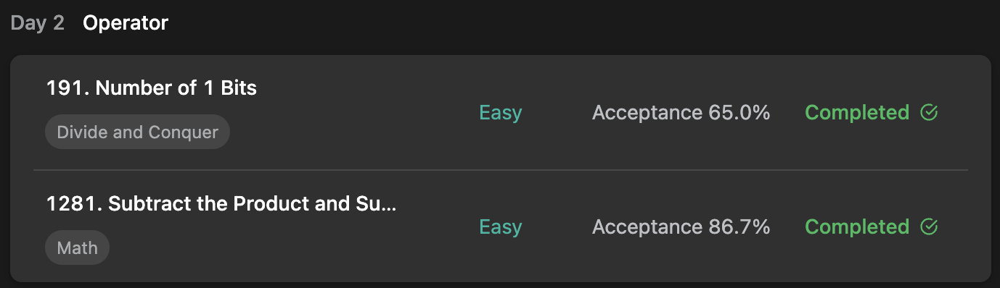

## LeetCode Algorithm StudyPlan



### Day 2

- [191. Number of 1 Bits](https://leetcode.com/problems/number-of-1-bits/?envType=study-plan&id=programming-skills-i)
- [1281. Subtract the Product and Sum of D](https://leetcode.com/problems/subtract-the-product-and-sum-of-digits-of-an-integer/?envType=study-plan&id=programming-skills-i)

---

#### 191. Number of 1 Bits

- **lang**  `kotlin` 
- **tags**  `Divide and Conqure` `Bit Manipulation`

```kotlin
class Solution {
    // you need treat n as an unsigned value
    fun hammingWeight(n:Int):Int {
        // return n.withSiftLeft()
        return n.withShiftRight()
    }
    // shifting subject = num oneself
    fun Int.withShiftRight(): Int {
        var result = 0
        var num = this
        for (i in 1..32) {
            result += num.and(1)
            num = num.shr(1)
        }
        return result
    }
    // shifting subject = posing variable
    fun Int.withShiftLeft(): Int {
        var result = 0
        var pos = 1
        for (i in 1..32) {
            if (and(pos) != 0) result++
            pos = pos.shl(1)
        }
        return result
    }
}
```

---

#### 1281. Subtract the Product and Sum of Digits of an Integer

- **lang**  `kotlin` 
- **tags**  `Math` 

```kotlin
class Solution {
    fun subtractProductAndSum(n: Int): Int {
        var mul = 1
        var sum = 0
        var num = n
        // calculate with each pos' num ( using mod and div )
        while (num > 0) {
            val mod = num % 10
            mul *= mod
            sum += mod
            num /= 10
        }
        return mul - sum
    }
}
```

---

