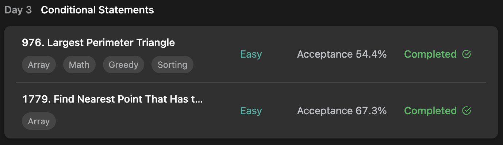

## LeetCode Algorithm StudyPlan



### Day 3

- [976. Largest Perimeter Triangle](https://leetcode.com/problems/largest-perimeter-triangle/?envType=study-plan&id=programming-skills-i)
- [1779. Find Nearest Point That Has the Same X or Y Coordinate](https://leetcode.com/problems/find-nearest-point-that-has-the-same-x-or-y-coordinate/?envType=study-plan&id=programming-skills-i)

---

#### 976. Largest Perimeter Triangle

- **lang**  `kotlin` 
- **tags**  `Array` `Math` `Greedy` `Sorting`

```kotlin
class Solution {
    fun largestPerimeter(nums: IntArray): Int {
        if (nums.size < 3) return 0
        // sort as reverse order
        nums.sortDescending()
        // if 8, 5, 2, 2, 1 => 8 5 2 miss ? 8 can't make triangle. so pass to next
        for (i in 0..nums.size-3) {
            if (nums[i+2] + nums[i+1] > nums[i]) return nums[i] + nums[i+1] + nums[i+2]
        }
        return 0
    }
}
```

---

#### 1779. Find Nearest Point That Has the Same X or Y Coordinate

- **lang**  `kotlin` 
- **tags**  `Array`

```kotlin
import kotlin.math.min
import kotlin.math.abs
class Solution {
    fun nearestValidPoint(x: Int, y: Int, points: Array<IntArray>): Int {
        var minIdx = -1
        var minD = Int.MAX_VALUE
        points.forEachIndexed { idx, point ->
            /*
                if points of minimum manhattanDistance are in idx (0, 4, 7, 11 , ..):
                    only 0 survive
                if current manhattanDistance is lowerThan minimumDistance:
                    current idx is minIdx
            */
            if (x == point[0] || y == point[1]) {
                val manD = abs(point[0]-x) + abs(point[1]-y)
                if (manD < minD) {
                    minD = manD
                    minIdx = idx
                }
            }
        }
        return minIdx
    }
}
```

---

