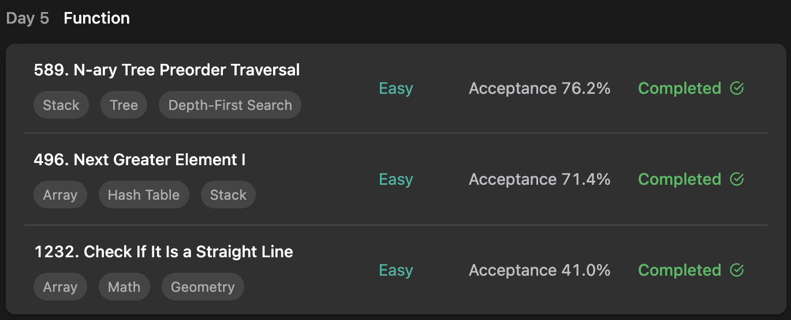

## LeetCode Algorithm StudyPlan



### Day 5

- [589. N-ary Tree Preorder Traversal](https://leetcode.com/problems/n-ary-tree-preorder-traversal/?envType=study-plan&id=programming-skills-i)
- [496. Next Greater Element I](https://leetcode.com/problems/next-greater-element-i/?envType=study-plan&id=programming-skills-i)
- [1232. Check If It Is a Straight Line](https://leetcode.com/problems/check-if-it-is-a-straight-line/?envType=study-plan&id=programming-skills-i)

---

#### 589. N-ary Tree Preorder Traversal

- **lang**  `kotlin` 
- **tags**  `Stack` `Tree` `BFS`

```kotlin
/**
 * Definition for a Node.
 * class Node(var `val`: Int) {
 *     var children: List<Node?> = listOf()
 * }
 */

class Solution {
    fun preorder(root: Node?): List<Int> {
        // dfs
        val result = mutableListOf<Int>()
        if (root == null) return result
        // function load for dfs
        fun dfs(node: Node) {
            result.add(node.`val`)
            node.children?.let { children ->
                children.forEach { child -> dfs(child!!) }
            }
        }
        dfs(root)
        return result
    }
}
```

---

