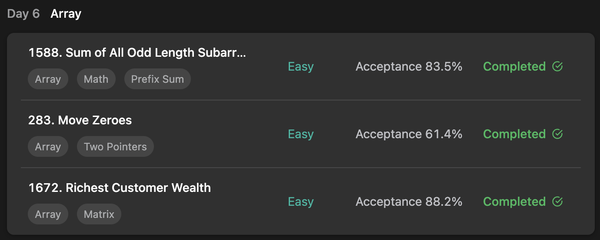

## LeetCode ProgrammingSkills StudyPlan



### Day 5

- [1588. Sum of All Odd Length Subarrays](https://leetcode.com/problems/sum-of-all-odd-length-subarrays/?envType=study-plan&id=programming-skills-i)
- [283. Move Zeroes](https://leetcode.com/problems/move-zeroes/?envType=study-plan&id=programming-skills-i)
- [1672. Richest Customer Wealth](https://leetcode.com/problems/richest-customer-wealth/?envType=study-plan&id=programming-skills-i)

---

#### 1588. Sum of All Odd Length Subarrays

- **lang**  `kotlin` 
- **tags**  `Array` `Math` `Prefix Sum`

```kotlin
class Solution {
    fun sumOddLengthSubarrays(arr: IntArray): Int {
        return arr.sumOfOddSubArr()
    }
    fun IntArray.sumOfOddSubArr(): Int {
        var result = 0
        for (i in 0..size-1) {
            /*
                ex_ [1,2,3]
                1xx, x2x, xx3
                12x, x23
                123
                count : 3 / 4 / 3
                if 4  : 4 / 6 / 6 / 4
                < occurrance in subarray >
                arr[i] -> total count : (n-i) * (i+1)
                in odd -> (total + 1) / 2
            */
            // arr[i] -> total n count 
            result += this[i] * (((size-i) * (i+1) + 1) / 2)
        }
        return result
    }
}
```

---

#### 283. Move Zeroes

- **lang**  `kotlin` 
- **tags**  `Array` `Two Pointers`

```kotlin
class Solution {
    fun moveZeroes(nums: IntArray): Unit {
        nums.moveZero()
    }
    fun IntArray.moveZero() {
        var zeroCount = 0
        for (idx in 0..size-1) {
            /*
                0 1 0 3 12 ( idx = 0, zc = 1 )
                1 0 0 3 12 ( idx = 1, zc = 1 )
                1 0 0 3 12 ( idx = 2, zc = 2)
                1 3 0 0 12 ( idx = 3, zc = 2)
                1 3 12 0 0 ( idx = 4, zc = 2)
                this[idx - zc] = this[idx]
                this[idx] = 0
            */
            if (this[idx] == 0) zeroCount++
            else if (zeroCount > 0) {
                this[idx - zeroCount] = this[idx]
                this[idx] = 0
            }
        }
    }
}
```

---

