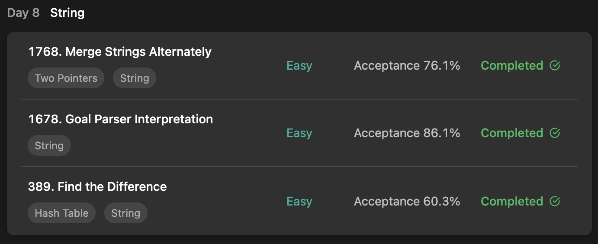

## LeetCode ProgrammingSkills StudyPlan



### Day 8

- [1768. Merge Strings Alternately](https://leetcode.com/problems/merge-strings-alternately/?envType=study-plan&id=programming-skills-i)
- [1678. Goal Parser Interpretation](https://leetcode.com/problems/goal-parser-interpretation/?envType=study-plan&id=programming-skills-i)
- [389. Find the Difference](https://leetcode.com/problems/find-the-difference/?envType=study-plan&id=programming-skills-i)

---

#### 1768. Merge Strings Alternately

- **lang**  `kotlin` 
- **tags**  `String` `Two Pointers`

```kotlin
import kotlin.math.max
class Solution {
    fun mergeAlternately(word1: String, word2: String): String {
        return word1 merge word2
    }
    // practice for infix
    infix fun String.merge(target: String): String {
        var result = mutableListOf<Char>()
        // pointer for each reader
        var (pointer1, pointer2) = 0 to 0
        while (pointer1 < length || pointer2 < target.length) {
            // get() not handle nullable, so use elementAtOrNull()
            elementAtOrNull(pointer1++)?.let { result.add(it) }
            target.elementAtOrNull(pointer2++)?.let { result.add(it) }
        }
        return result.joinToString("")
    }
}
```

---

#### 1678. Goal Parser Interpretation

- **lang**  `kotlin` 
- **tags**  `String`

```kotlin
class Solution {
    fun interpret(command: String): String {
        var result = mutableListOf<Char>()
        var i = 0
        while (i < command.length) {
            // handle by each commands' input-entrance
            when(command[i]) {
                'G' -> { result.add(command[i++]) }
                '(' -> {
                    // consume by size of each commands
                    if (command[i+1] == ')') {
                        result.add('o')
                        i += 2
                    } else if (command[i+1] == 'a') {
                        result.add('a')
                        result.add('l')
                        i += 4
                    }
                }
                else -> break
            }
        }
        return result.joinToString("")
    }
}
```

---

#### 389. Find the Difference

- **lang**  `kotlin` 
- **tags**  `String` `Hash Table` `Bit Manipulation` `Sorting` 

```kotlin
class Solution {
    fun findTheDifference(s: String, t: String): Char {
        return s getDiff t
    }
    // with xor calculation, different one can be found
    /* 
        think Below case,
        0100 ^ 1011 ^ 0100 = 1111 ^ 0100 = 1011
        bitwise-xor can be erased by doubled-xor
    */
    infix fun String.getDiff(target: String): Char {
        var result = 0
        this.forEach { result = result.xor(it.toInt()) }
        target.forEach { result = result.xor(it.toInt()) }
        return result.toChar()
    }
}
```

---

