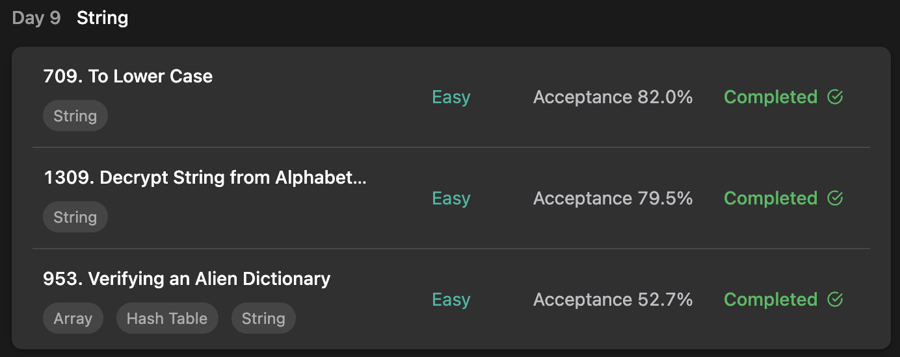

## LeetCode ProgrammingSkills StudyPlan



### Day 9

- [709. To Lower Case](https://leetcode.com/problems/to-lower-case/?envType=study-plan&id=programming-skills-i)
- [1309. Decrypt String from Alphabet to Integer Mapping](https://leetcode.com/problems/decrypt-string-from-alphabet-to-integer-mapping/?envType=study-plan&id=programming-skills-i)
- [953. Verifying an Alien Dictionary](https://leetcode.com/problems/verifying-an-alien-dictionary/?envType=study-plan&id=programming-skills-i)

---

#### 709. To Lower Case

- **lang**  `kotlin` 
- **tags**  `String`

```kotlin
class Solution {
    fun toLowerCase(s: String): String {
        val arr = mutableListOf<Char>().apply {
            // in ascii - solution
            s.forEach { c ->
                add(if (c.toInt() in 65..90) (c+32).toChar() else c)
            }
        }
        return arr.joinToString("")
    }
}
```

---

#### 1309. Decrypt String from Alphabet to Integer Mapping

- **lang**  `kotlin` 
- **tags**  `String`

```kotlin
class Solution {
    fun freqAlphabets(s: String): String {
        var result = ""
        var i = s.length - 1
        while (i >= 0) {
            // get decoded based on rule.
            val decoded = if (s[i] == '#') {
                // if met #, decode next 2 words
                val sec = s[--i]
                val fir = s[--i]
                "$fir$sec".applyDecode()
            } else "${s[i]}".applyDecode()
            // add string to front-direction
            result = decoded + result
            i --
        }
        return result
    }
    fun String.applyDecode(): Char {
        // in ascii, 'a' = 65
        return (this.toInt() + 'a'.toInt() - 1).toChar()
    }
    
}
```

---

#### 953. Verifying an Alien Dictionary

- **lang**  `kotlin` 
- **tags**  `String` `Array` `Hash Table`

```kotlin
import kotlin.math.min
class Solution {
    fun isAlienSorted(words: Array<String>, order: String): Boolean {
        val dictionary = order.buildAlienDict()
        // check two consecutive string is in order
        fun isInOrder(s1: String, s2: String): Boolean {
            val (len1, len2) = s1.length to s2.length
            for (idx in 0..min(len1, len2)-1) {
                // if two characters are same, it's in order
                // else
                if (s1[idx] != s2[idx]) {
                    // if c1 has smaller index than c2, is in correct order
                    return dictionary[s1[idx] -'a'] < dictionary[s2[idx] - 'a']
                }
            }
            // if length is same or small, it's in order
            return len1 <= len2
        }
        // traverse each consecutive words.
        for (i in 0..words.size-2) {
            if (!isInOrder(words[i], words[i+1])) return false
        }
        return true
    }
    /*
        build alien dictionary from given order string.
        each characters map as order index
    */
    fun String.buildAlienDict(): IntArray {
        val arr = IntArray(26)
        forEachIndexed { idx, c -> arr[c-'a'] = idx }
        return arr
    }
}
```

---

