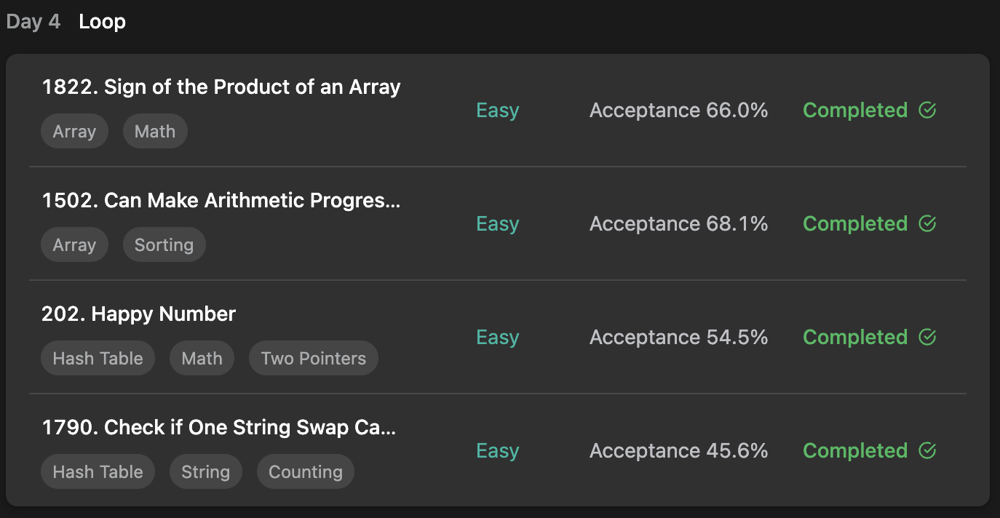

## LeetCode Algorithm StudyPlan



### Day 4

- [1822. Sign of the Product of an Array](https://leetcode.com/problems/sign-of-the-product-of-an-array/?envType=study-plan&id=programming-skills-i)
- [1502. Can Make Arithmetic Progression From Sequence ](https://leetcode.com/problems/can-make-arithmetic-progression-from-sequence/?envType=study-plan&id=programming-skills-i)
- [202. Happy Number](https://leetcode.com/problems/happy-number/?envType=study-plan&id=programming-skills-i)
- [1790. Check if One String Swap Can Make Strings Equal](https://leetcode.com/problems/check-if-one-string-swap-can-make-strings-equal/?envType=study-plan&id=programming-skills-i)

---

#### 1822. Sign of the Product of an Array

- **lang**  `kotlin` 
- **tags**  `Array` `Math` 

```kotlin
class Solution {
    fun arraySign(nums: IntArray): Int {
        var result = 1
        // sign(product nums) = product of each sign(num in nums)
        nums.forEach { value -> result *= when {
            value > 0 -> 1
            value < 0 -> -1
            else -> 0
        }}
        return result
    }
}
```

---

#### 1502. Can Make Arithmetic Progression From Sequence

- **lang**  `kotlin` 
- **tags**  `Array` `Sorting`

```kotlin
class Solution {
    fun canMakeArithmeticProgression(arr: IntArray): Boolean {
        // find optimal gap
        arr.sort()
        val gap = arr[1] - arr[0]
        // loop each elements, but not same with optimal gap, return false
        for(i in 2..arr.size-1) if (arr[i]-arr[i-1] != gap) return false
        return true
    }
}
```

---

#### 202. Happy Number

- **lang**  `kotlin` 
- **tags**  `Hash Table` `Math` `Tow Pointers`

```kotlin
class Solution {
    // memorize passed number
    private val memo = mutableSetOf<Int>()
    fun isHappy(n: Int): Boolean {
        return beHappy(n)
    }
    fun beHappy(n: Int): Boolean {
        // if memorized refaced, it's cycle.
        if (memo.contains(n)) return false
        // find happy number
        if (n == 1) return true
        memo.add(n)
        // create next number based on happy rule
        var happyRule = 0
        var num = n
        while (num > 0) {
            val mod = num%10
            happyRule += mod * mod
            num /= 10
        }
        return beHappy(happyRule)
    }
}
```

---

