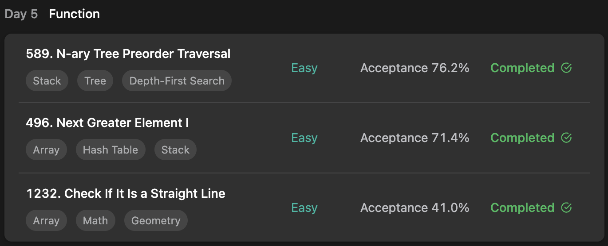

## LeetCode ProgrammingSkills StudyPlan



### Day 5

- [589. N-ary Tree Preorder Traversal](https://leetcode.com/problems/n-ary-tree-preorder-traversal/?envType=study-plan&id=programming-skills-i)
- [496. Next Greater Element I](https://leetcode.com/problems/next-greater-element-i/?envType=study-plan&id=programming-skills-i)
- [1232. Check If It Is a Straight Line](https://leetcode.com/problems/check-if-it-is-a-straight-line/?envType=study-plan&id=programming-skills-i)

---

#### 589. N-ary Tree Preorder Traversal

- **lang**  `kotlin` 
- **tags**  `Stack` `Tree` `BFS`

```kotlin
/**
 * Definition for a Node.
 * class Node(var `val`: Int) {
 *     var children: List<Node?> = listOf()
 * }
 */

class Solution {
    fun preorder(root: Node?): List<Int> {
        // dfs
        val result = mutableListOf<Int>()
        if (root == null) return result
        // function load for dfs
        fun dfs(node: Node) {
            result.add(node.`val`)
            node.children?.let { children ->
                children.forEach { child -> dfs(child!!) }
            }
        }
        dfs(root)
        return result
    }
}
```

---

#### 496. Next Greater Element I

- **lang**  `kotlin` 
- **tags**  `Array` `Hash Table` `Stack` `Monotonic Stack`

```kotlin
class Solution {
    fun nextGreaterElement(nums1: IntArray, nums2: IntArray): IntArray {
        return findNextGreater(nums1, nums2)
    }
    fun findNextGreater(nums1: IntArray, nums2: IntArray): IntArray {
        val greaterMap = mutableMapOf<Int, Int>()
        val stack = Stack<Int>()
        // record each number's next greater
        // all numbers are unique, so using stack and record each greater of them.
        nums2.forEach { value ->
            while(stack.isNotEmpty() && stack.peek() < value) greaterMap[stack.pop()] = value
            stack.push(value)
        }
        // traverse nums1 and allocate each's next greater
        nums1.forEachIndexed { idx, value -> nums1[idx] = greaterMap[value] ?: -1 }
        return nums1
    }
}
```

---

#### 1232. Check If It Is a Straight Line

- **lang**  `kotlin` 
- **tags**  `Array` `Math` `Geometry` 

```kotlin
class Solution {
    // object oriented for separate each line type
    interface LineType {
        object Vertical: LineType
        object Horizontal: LineType
        data class Straight(val incline: Double): LineType
    }
    
    fun checkStraightLine(coordinates: Array<IntArray>): Boolean {
        val lineType = makeLine(coordinates[0], coordinates[1])
        for (i in 2..coordinates.size-1) {
            // if one line is different with base lineType, it's not all-covered straight line
            if (makeLine(coordinates[i], coordinates[i-1]) != lineType) return false
        }
        return true
    }
    // function to make line from given 2 points
    fun makeLine(p1: IntArray, p2: IntArray): LineType {
        return when {
            p1[0] == p2[0] -> LineType.Vertical
            p1[1] == p2[1] -> LineType.Horizontal
            else -> LineType.Straight((p2[1] - p1[1]).toDouble() / (p2[0] - p1[0]))
        }
    }
}
```

---

