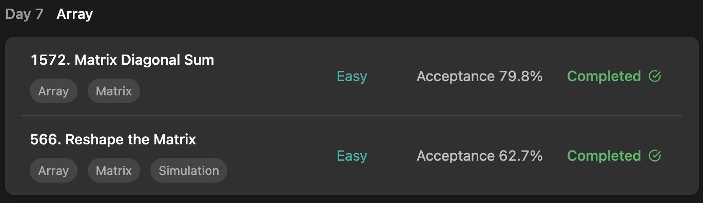

## LeetCode ProgrammingSkills StudyPlan



### Day 7

- [1572. Matrix Diagonal Sum](https://leetcode.com/problems/matrix-diagonal-sum/?envType=study-plan&id=programming-skills-i)
- [566. Reshape the Matrix](https://leetcode.com/problems/reshape-the-matrix/?envType=study-plan&id=programming-skills-i)

---

#### 1572. Matrix Diagonal Sum

- **lang**  `kotlin` 
- **tags**  `Array` `Matrix`

```kotlin
class Solution {
    fun diagonalSum(mat: Array<IntArray>): Int {
        var result = 0
        val len = mat.size
        // loop
        for (i in 0..len/2-1) {
            // add each 4-direction's element from edge to center
            result += (
                mat[i][i] + mat[i][len-1-i] + mat[len-1-i][len-1-i] + mat[len-1-i][i]
            )
        }
        // if length is odd number, add center element
        return if (len % 2 == 1) result + mat[len/2][len/2] else result
    }
}
```

---

#### 566. Reshape the Matrix

- **lang**  `kotlin` 
- **tags**  `Array` `Matrix` `Simulation`

```kotlin
class Solution {
    fun matrixReshape(mat: Array<IntArray>, r: Int, c: Int): Array<IntArray> {
        val (h, w) = mat.size to mat[0].size
        if (h * w != r * c) return mat
        // flatten given matrix for easy-iteration
        val flat = mutableListOf<Int>().apply { 
            for(i in 0..mat.size-1) addAll(mat[i].toList())
        }.toIntArray()
        // copy subarray of range each row ( = c ) and add to result
        var result = arrayOf<IntArray>()
        for(row in 0..r-1) {
            result += flat.copyOfRange(row * c, (row + 1) * c)
        }
        return result
    }
}
```

---

